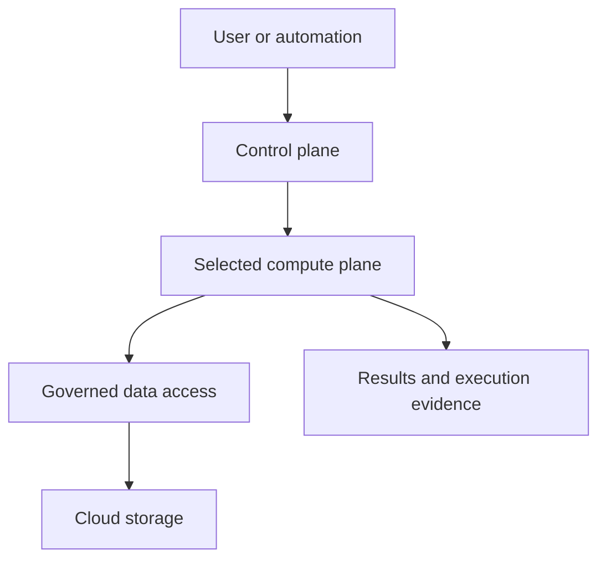

# Chapter 003 — Control Plane, Compute Plane & Cloud Storage

**Part:** 01 — Foundations & Architecture  
**Level:** Beginner / operational foundations  
**Estimated time:** 60–90 minutes  
**Prerequisites:** Chapters 001–002, basic SQL/Python, approved lab workspace  
**Content status:** Authored  
**Lab status:** Implemented; Databricks workspace execution pending  
**Last reviewed:** 2026-10-09

## 1. Learning objectives

- Explain control-plane and compute-plane responsibilities.
- Distinguish classic compute from serverless compute.
- Trace a notebook request to a governed table and its storage.
- Separate workspace identity, data privileges, storage authorization, and networking.
- Verify durable data from another session.
- Collect useful evidence without claiming unobserved network behavior.

## 2. The three responsibilities

### 2.1 Control plane: manage and coordinate

The control plane contains Databricks-managed services, including the web application. It supports workspace interactions and coordination of workloads.

You use the workspace UI or APIs to create assets, configure jobs, and submit work. Those actions do not mean your browser itself processes the complete dataset.

Avoid the blanket statement “no data ever reaches the control plane.” Notebook outputs, query results, logs, and platform metadata have their own handling and configuration. Evaluate actual service documentation and your organization’s controls.

### 2.2 Compute plane: execute work

The compute plane runs processing. In Spark workloads, the driver coordinates execution and executors perform tasks. Query and execution architecture varies with compute type.

Compute reads authorized input, applies transformations, and writes output. It can also hold temporary variables, caches, and local files that are not durable table storage.

### 2.3 Cloud storage: persist data

Object storage holds durable files and table data. Unity Catalog-managed tables use configured managed storage; external tables reference separately managed storage locations.

A table name is a governed identifier. Its data files are stored at a physical location. Access through the table name preserves the intended governance path.

Do not directly modify managed table directories, transaction logs, or data files.

## 3. Classic and serverless boundaries

This chapter uses AWS as its main example.

| Dimension | Classic compute | Serverless compute |
|---|---|---|
| Compute infrastructure | Runs in the customer’s AWS account for classic deployments | Runs in Databricks-managed infrastructure |
| Infrastructure administration | Customer/platform team has responsibilities for cloud networking and related configuration | Databricks manages compute infrastructure; customers still govern data access and supported connectivity controls |
| Network troubleshooting | Inspect approved customer VPC configuration and compute events | Inspect serverless connectivity configuration and available platform evidence |
| Resource visibility | Authorized cloud admins may inspect corresponding cloud resources | Do not expect serverless resources in the customer EC2 inventory |
| Data access | Must satisfy governance, storage authorization, and network requirements | Must also satisfy these requirements; controls differ |
| Operational implication | Customer VPC routing can affect workloads | Customer VPC routes alone do not describe serverless egress |

A workspace can support multiple compute types. “This workspace is in AWS” is not sufficient to identify where a particular workload executes.

The phrase **Databricks account** can describe an administrative account. Do not confuse it with the customer’s AWS account. Record the actual infrastructure ownership boundary.

Azure and GCP have corresponding cloud-specific implementations. GovCloud and regional availability must be checked explicitly. Do not assume commercial-region serverless features exist in every environment.

### 3.1 Request and data-access relationships



This is a responsibility diagram, not a packet capture. Governance is a logical authorization relationship; it does not assert that every storage byte passes through a catalog service.

### 3.2 Three network paths to distinguish

| Path | Purpose | Example failure |
|---|---|---|
| User/API client → workspace services | Access UI and submit requests | Login, access list, or front-end connectivity |
| Classic compute → control services | Workload coordination | Compute cannot establish required service connectivity |
| Compute → data source/storage | Read/write data | Storage denial, DNS, route, firewall, or endpoint failure |

Serverless uses its own connectivity model. A working workspace page proves neither storage connectivity nor source database access.

## 4. Identity and authorization layers

| Layer | Question |
|---|---|
| Workspace | Can this identity access the notebook or job? |
| Compute | Can it use the selected execution resource? |
| Catalog/schema | Can it resolve and use the namespace? |
| Table/volume | Can it perform the requested read/write operation? |
| Cloud credentials | Can the platform access the storage through its configured authorization? |
| Network | Can the selected compute reach the target? |

The notebook user does not necessarily pass a personal AWS credential to every storage request. Unity Catalog storage access uses configured platform credential mechanisms.

Do not solve a permission error by adding broad cloud or catalog administrator privileges.

## 5. Lab — Trace a table read through the platform

### 5.1 Outcomes and limits

You will create a tiny managed Delta table, inspect its metadata, read it from another session, and classify a controlled missing-table error.

This lab validates table access and persistence. It does not prove the precise network route, private connectivity, cloud account ownership, absence of caching, or concurrent transaction isolation. Those require separate configuration and operational evidence.

### 5.2 Requirements

- A Python notebook and approved Spark-capable compute.
- Unity Catalog-compatible compute.
- An approved catalog/schema with managed storage.
- USE CATALOG, USE SCHEMA, and CREATE TABLE permissions.
- Access to table metadata and available compute details.
- Budget for execution.

No new cloud network, IAM role, external location, or cluster provisioning is required. If table creation is blocked, use an administrator-provided disposable equivalent and document what you could not validate.

### Step 1 — Inventory the deployment

Create notebook `dbx-ch003-plane-boundaries`.

Record:

| Field | Value / evidence |
|---|---|
| Date and workspace label | |
| Cloud and region | |
| Notebook compute type | |
| Classic or serverless | |
| Runtime if exposed | |
| Compute identifier if visible | |
| Infrastructure ownership | Verified / administrator confirmed / unknown |
| Catalog and schema | |
| Managed storage configured | Confirmed / unknown |
| Network route to storage | Verified by separate evidence / unknown |
| Cost or quota constraint | |

Use the notebook compute selector and available compute details. Label unavailable facts **unknown**. Do not infer cloud account ownership from the workspace hostname or the value of spark.version.

For classic compute, an authorized administrator may correlate the compute with cloud configuration. For serverless, record the available serverless configuration rather than looking for EC2 instances in the customer account.

### Step 2 — Configure an isolated table name

```python
import re
import uuid

catalog = "REPLACE_WITH_APPROVED_CATALOG"
schema_name = "REPLACE_WITH_APPROVED_SCHEMA"

for value in (catalog, schema_name):
    assert "REPLACE_WITH" not in value, "Configure the approved namespace"
    assert re.fullmatch(r"[A-Za-z_][A-Za-z0-9_]*", value), (
        "This lab uses simple identifiers"
    )

run_id = uuid.uuid4().hex[:12]
table_name = f"ch003_plane_trace_{run_id}"
table = f"`{catalog}`.`{schema_name}`.`{table_name}`"
assert not spark.catalog.tableExists(table)

display(spark.sql("""
    SELECT current_user() AS executing_identity,
           current_catalog() AS current_catalog,
           current_schema() AS current_schema
"""))
print("Keep this table name for validation and cleanup:", table)
```

**Expected:** One identity/context row and a unique fully qualified table name.

The current default catalog/schema may differ from the configured namespace. Subsequent operations use the fully qualified name.

### Step 3 — Create the durable table

```python
records = [
    ("E001", "North", 120),
    ("E002", "North", 60),
    ("E003", "South", 90),
]
source = spark.createDataFrame(
    records,
    "encounter_id STRING, facility STRING, duration_minutes INT"
)
source.write.format("delta").mode("errorifexists").saveAsTable(table)

assert spark.table(table).count() == 3
display(spark.table(table).orderBy("encounter_id"))
```

**Expected:** Three rows. No existing table is replaced.

The notebook is the development asset; compute performs the write; the table namespace and configured storage define the durable destination.

### Step 4 — Inspect storage and table metadata

```python
detail = spark.sql(f"DESCRIBE DETAIL {table}")
display(detail)
display(spark.sql(f"DESCRIBE TABLE EXTENDED {table}"))
display(spark.sql(f"DESCRIBE HISTORY {table}"))

info = detail.first().asDict()
assert info["format"] == "delta"
assert info["location"], "Expected a reported table location"
print("PASS: Delta table metadata and storage location are available")
```

**Expected:**

- Delta format.
- A storage location in table detail.
- Extended metadata identifying table properties/type.
- An initial write in history.

Do not hard-code expectations about directory structure. Managed storage layout is generated by the platform.

A location identifies where table data resides. It does not prove whether a request used NAT, a private endpoint, a cache, or another network path. Keep internal paths out of public evidence.

### Step 5 — Read and aggregate the table

```python
result = spark.sql(f"""
    SELECT facility,
           COUNT(*) AS encounter_count,
           SUM(duration_minutes) AS total_minutes
    FROM {table}
    GROUP BY facility
    ORDER BY facility
""")
display(result)

actual = {
    r["facility"]: (int(r["encounter_count"]), int(r["total_minutes"]))
    for r in result.collect()
}
assert actual == {"North": (2, 180), "South": (1, 90)}
print("PASS: governed table query returns expected aggregates")
```

**Expected:**

| facility | encounter_count | total_minutes |
|---|---|---|
| North | 2 | 180 |
| South | 1 | 90 |

Inspect available query details or Spark execution information. Record a timestamp and execution identifier if the interface exposes one. Visibility differs by compute and workspace policy.

A physical query plan can help explain execution, but does not prove the underlying cloud packet route.

### Step 6 — Compare durable and session-scoped objects

In the original notebook:

```python
spark.table(table).createOrReplaceTempView("ch003_session_view")
assert spark.table("ch003_session_view").count() == 3
print("PASS: session view reads the table")
```

Open a new notebook session on approved compatible compute. Replace the table placeholder with the exact fully qualified name printed earlier:

```python
table_to_check = "REPLACE_WITH_FULLY_QUALIFIED_TABLE_NAME"
assert "REPLACE_WITH" not in table_to_check

assert spark.table(table_to_check).count() == 3
print("PASS: durable table is readable from this session")
```

Then run in that new session:

```python
print("Temporary view visible here:",
      spark.catalog.tableExists("ch003_session_view"))
```

**Expected:** The table query returns three rows. In a genuinely separate Spark session, the local temporary view is not visible. If the view is visible, verify session isolation or a same-named object before drawing a conclusion.

Do not terminate shared compute to perform this check. If you cannot get a separate session, mark that acceptance check pending.

### Step 7 — Controlled failure: nonexistent table

Run in the original notebook:

```python
missing_name = f"ch003_missing_{run_id}"
missing_table = f"`{catalog}`.`{schema_name}`.`{missing_name}`"

assert not spark.catalog.tableExists(missing_table)
try:
    spark.table(missing_table).count()
except Exception as exc:
    error_class = (
        exc.getErrorClass()
        if callable(getattr(exc, "getErrorClass", None))
        else type(exc).__name__
    )
    print("Observed failure:", error_class)
    print(str(exc)[:800])
else:
    raise AssertionError("Expected a missing-table failure")
```

**Expected:** A table/view-not-found failure, with wording/error class dependent on runtime.

This is a name-resolution failure in an accessible namespace. It is not evidence of an S3 outage or broken VPC route.

If the observed error instead concerns catalog permission or compute execution, investigate that layer and record it accurately.

### Step 8 — Complete the trace worksheet

| Action | Observed evidence | Responsibility |
|---|---|---|
| Create/open notebook | Workspace asset and UI | Control-plane/workspace services |
| Connect execution resource | Compute selector/details | Compute plane |
| Create table | Successful write and initial history | Compute plus governed storage |
| Inspect namespace/type | Catalog metadata | Governance |
| Inspect location | DESCRIBE DETAIL | Storage metadata |
| Aggregate table | Expected result and execution evidence | Compute/data access |
| Read in separate session | Three rows from table name | Durable table persistence |
| Query missing table | Missing-object error | Object resolution |

Distinguish observation from inference. “Query succeeded” is observed. “Traffic used a private endpoint” remains unknown without networking evidence.

## 6. Acceptance criteria

- Classic/serverless classification recorded with its evidence.
- Infrastructure and network facts labelled verified, confirmed, or unknown.
- Three-row managed Delta table created in an approved namespace.
- Delta metadata, storage location, and history inspected.
- North = 2/180 and South = 1/90 assertions pass.
- Separate-session table read succeeds or is explicitly pending.
- Temporary-view behavior recorded with session caveat.
- Missing-object error classified correctly.
- Cleanup verified.

Record execution date, runtime/compute type, table name, results, errors, and limitations. No Databricks workspace execution was performed during authoring.

## 7. Operational implications

### 7.1 Compute availability and data durability

A stopped compute resource may prevent immediate queries while durable table data remains. Compute failure and storage loss are different incidents.

### 7.2 Successful UI access is a narrow signal

A working browser session says little about a workload’s source connectivity. Diagnose workspace access, compute startup, governance, storage authorization, and network access separately.

### 7.3 Caching affects interpretation

A successful read may benefit from caching. Table query success alone does not prove a fresh physical storage read. Use supported platform and cloud telemetry for that question.

### 7.4 Classic networking does not configure serverless networking

A route or endpoint configured in the customer VPC may help classic compute without configuring serverless access. Follow the relevant serverless connectivity model.

### 7.5 Metadata is useful but not complete

Table location, query identifiers, and compute events are starting points. A full network investigation may require administrator-visible connectivity configuration, cloud audit events, endpoint configuration, and flow evidence.

### 7.6 Recovery spans multiple assets

Data, catalogs/permissions, notebook or package code, job definitions, identities, and connectivity configuration may require distinct recovery procedures. Table history alone is not a complete workspace recovery plan.

## 8. Troubleshooting matrix

| Symptom | First evidence | Likely layer | Next action |
|---|---|---|---|
| Cannot open workspace | Login error, URL, timestamp | Workspace/authentication/connectivity | Verify identity and approved workspace access |
| Can open notebook but cannot connect | Compute selector and events | Compute permission/capacity | Check execution rights and resource state |
| Compute starts but table access denied | Full error, identity, namespace | Governance | Verify narrowly scoped catalog/schema/table privileges |
| Table name not found | Fully qualified name and metadata | Object resolution | Confirm namespace, spelling, and object existence |
| Storage denial during write | Storage error and configured location | Storage authorization/configuration | Platform owner verifies credential and managed storage |
| Source access times out | Target, compute type, timestamps | Networking or source availability | Check DNS/routes/endpoints using authorized evidence |
| Classic works, serverless fails | Same input plus compute-specific settings | Different access/connectivity path | Compare serverless governance and connectivity controls |
| Temp view missing after session change | Session and setup cells | Session scope | Recreate the view or use the durable table |
| SQL warehouse cannot read table | Warehouse identity/configuration and error | Compute/governance | Verify supported catalog and table permissions |

Do not recreate a table or alter network policy until evidence identifies the failed layer.

## 9. Cleanup and rollback

Run in the original notebook, using the values from Step 2:

```python
assert re.fullmatch(r"[a-f0-9]{12}", run_id)
assert table_name == f"ch003_plane_trace_{run_id}"
assert table == f"`{catalog}`.`{schema_name}`.`{table_name}`"

spark.catalog.dropTempView("ch003_session_view")
spark.sql(f"DROP TABLE IF EXISTS {table}")
assert not spark.catalog.tableExists(table)
print("PASS: lab table removed")
```

Do not delete the physical managed-storage directory yourself. Table deletion follows platform lifecycle policies and may not immediately remove physical bytes.

Remove disposable notebooks after saving evidence. Disconnect compute; stop it only if dedicated to the lab. This exercise does not change network or cloud identity configuration.

If a session resets, recover the exact table name from saved evidence before cleanup. Do not drop unrelated objects by broad prefix.

## 10. Review questions and answers

1. **Where does the web application run?** In the Databricks-managed control plane.
2. **Where does classic AWS compute run?** In the customer’s AWS account for classic deployments.
3. **Should serverless compute appear in customer EC2 inventory?** Generally no; serverless compute is Databricks-managed.
4. **Does a storage location prove private routing?** No; routing needs separate evidence.
5. **Does stopping compute delete a managed table?** Normally no; compute and durable storage have different lifecycles.
6. **Why did the temporary view disappear?** It is session-scoped rather than a persisted table.
7. **Does a table-not-found error indicate a network outage?** No; start with name resolution and permissions.
8. **What does a working table query prove?** That the selected identity/compute can perform that operation at that time, within the limits of caching and available evidence.

## 11. Official references

- [High-level architecture](https://docs.databricks.com/aws/en/getting-started/high-level-architecture/)
- [Network reference architecture](https://docs.databricks.com/aws/en/security/network/deployment-architecture)
- [Classic compute networking](https://docs.databricks.com/aws/en/security/network/classic)
- [Serverless compute networking](https://docs.databricks.com/aws/en/security/network/serverless-network-security/)
- [Managed storage locations](https://docs.databricks.com/aws/en/connect/unity-catalog/cloud-storage/managed-storage)
- [Unity Catalog best practices](https://docs.databricks.com/aws/en/data-governance/unity-catalog/best-practices/)
- [Object storage lifecycle](https://docs.databricks.com/aws/en/data-governance/unity-catalog/object-storage-lifecycle)

Synthetic fixtures and lab code are original examples. Verify cloud/region-specific documentation before production design.

## 12. Navigation and progress

**Previous:** [Chapter 002 — Data Lakes, Warehouses & Lakehouses](002-data-lakes-warehouses-lakehouses.md)  
**Current:** Chapter 003 — Control Plane, Compute Plane & Cloud Storage  
**Next:** [Chapter 004 — Spark, Delta Lake, Unity Catalog & MLflow](004-spark-delta-lake-unity-catalog-mlflow.md)

| Item | Status |
|---|---|
| Content | Authored |
| Lab | Implemented; workspace execution pending |
| Network route verification | Outside the core lab; separate evidence required |
| Repository publication | Included in the Databricks rebuild commit; see Git history |
| Series authored | 3/100 chapters |
| Series workspace-validated | 0/100 labs |

Full completion requires execution and review evidence under the master plan.

