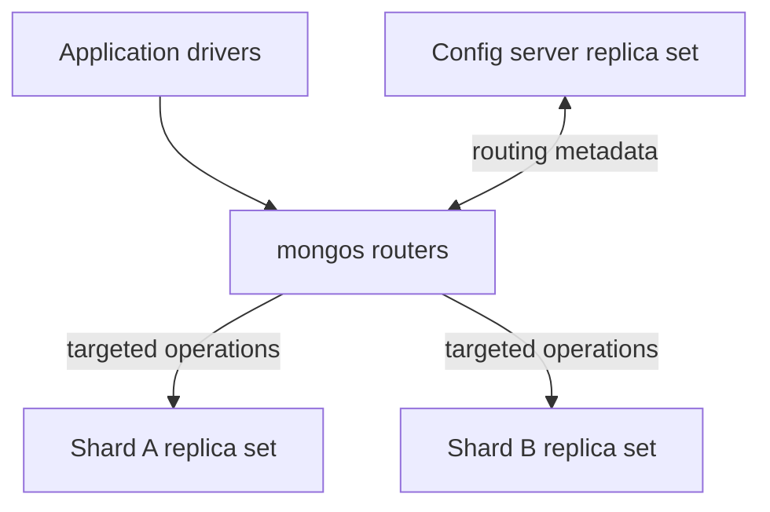

# 33 — Sharded Cluster Architecture

**Status:** Written; static review complete; runtime lab validation pending  
**Part:** 5 — Sharding and Scale  
**Goal:** Explain cluster roles and request paths, distinguish replication from distribution, verify routing boundaries in a synthetic model and inspect a real router through an optional read-only path.  
**Audience:** Developers, Data Engineers, DBREs, SREs and Platform Engineers  
**Time:** 90–120 minutes  
**Baseline:** MongoDB 8.0 and mongosh; record exact versions/image digest.  
**Deployment:** Core lab uses the existing owned Chapter 26 `rs26`. Synthetic plan/range documents are ordinary application collections, not MongoDB sharding metadata.  
**Prerequisites:** Chapters 25–32; healthy original replica set, no active failure exercise, scoped lab access. Optional live inspection requires an approved existing sharded cluster.

## 1. The architecture and its request paths

Sharding distributes a collection's data and work across shard replica sets. Replication preserves multiple copies within each replica set. Adding secondaries to one replica set does not turn it into multiple independent write shards.



The diagram groups redundant routers into one role and shows a dedicated config-server design. Each shard has its own replica-set membership, primary, history and recovery responsibilities. Routers use cluster metadata to choose destinations and combine results as needed.

**Use case:** A tenant event service exceeds a single replica set's sustainable storage/write capacity. The team must assess whether its access patterns can distribute across shards without turning every request into cluster-wide work.

This chapter establishes the architecture contract. Chapter 34 evaluates shard keys; Chapter 35 builds an actual multi-shard cluster. The core lab below deliberately does not claim to execute real `mongos` routing.

## 2. Component responsibilities

| Component | Process/role | Responsibility | Operational evidence |
|---|---|---|---|
| Router | `mongos` | Cluster entry point, destination selection and result coordination | Router hello, errors/latency, approved cluster inventory |
| Shard | `mongod` shard replica set | Stores owned application data and handles its work | Per-shard roles, lag, storage, query and write metrics |
| Config server replica set | Config-server `mongod` members | Cluster metadata and coordination state | CSRS health, metadata operations and backups |
| Application driver | Client | Router selection, pooling, concerns and request deadlines | URI options, traces, request identities and retry outcomes |
| Balancer | Cluster service | Data-range migration according to placement policy | Balancer/migration status and per-shard resource impact |

`mongos` does not have its own replica-set election. Use multiple reachable routers for router availability. The CSRS and every shard replica set have separate election/acknowledgement paths; there is no single majority vote across all cluster processes.

Applications connect through routers for both sharded and unsharded collections. Direct shard connections are specialized administration paths, not a substitute application endpoint. MongoDB 8.0 also restricts certain direct-shard operations; this chapter grants no maintenance bypass role.

## 3. Collection placement and MongoDB 8.0 differences

Sharding is a collection-level property. A database can contain both distributed and unsharded collections. One shard can own several disjoint ranges, and an unsharded collection remains on one shard even when the cluster contains several shards.

Do not equate a database's primary-shard label with a shard replica set's elected primary member. They describe placement and leadership respectively. MongoDB 8.0 supports moving unsharded collections, so verify current placement rather than assuming every unsharded collection is permanently on the database's primary shard.

MongoDB 8.0 supports a config shard combining application-data storage with the config-server role. A dedicated CSRS isolates those responsibilities. This chapter's planned architecture chooses a dedicated CSRS for clarity; it is not a claim that config shards are unsupported or inherently incorrect.

Inspect deployed topology before estimating resources. The optional real-router inventory identifies a config shard through the documented `listShards` entry with `_id:"config"`. Do not run topology-transition commands merely to match a teaching diagram.

## 4. Routing, scaling and failure boundaries

| Operation shape | Architecture implication | Evidence required later |
|---|---|---|
| Equality on a suitable shard key | Potentially narrow destination set | Actual router explain/target information |
| Range on a ranged shard key | May intersect several owned ranges | Query bounds, placement and executed plan |
| Predicate without usable routing information | Potential scatter/gather | Actual target count and latency/work per shard |
| Monotonic/highly skewed key | Potential concentration of writes | Key distribution and hot-range metrics |
| Multiple logical ranges assigned evenly | Does not establish balanced request load | Bytes, QPS, CPU, I/O and tenant skew |

A routed query still needs appropriate indexes on the destination. Sharding does not correct an expensive predicate, excessive result size, hot tenant or insufficient storage throughput by itself. Hashed and ranged designs have different locality and routing tradeoffs; do not choose a key from this toy range map.

| Failure | Impact to assess |
|---|---|
| One router unavailable | Drivers' access to remaining routers and selection deadlines |
| A shard primary unavailable | That shard's election/write interruption and affected collection ranges |
| Entire shard unavailable | Operations requiring its data; other targeted work may still succeed |
| CSRS lacks a primary | Metadata writes/migrations affected; existing shard data operations are not automatically all unavailable |
| All config servers unavailable | Cluster operation can become inoperable; metadata access and recovery are critical |

Do not claim complete business results from partial cluster availability. Target requirements, read/write concerns and application semantics determine whether a request can succeed correctly.

## 5. Core lab setup: retain the replica-set environment

No new cluster infrastructure is created in the core lab. Use the original Chapter 26 project and an independent seeded client:

```bash
docker compose -p mongodb-ch26 -f compose.yaml ps
docker run --rm -it --network mongodb-ch26_replica mongo:8.0 mongosh "mongodb://a:27017,b:27017,c:27017/?replicaSet=rs26&readPreference=primary&serverSelectionTimeoutMS=5000"
```

Use the approved image digest. The isolated network has no published host ports. Record versions, original storage and network ownership. Ensure no Chapter 32 writer is running.

Permissions cover status inspection and this chapter's named database. Optional live cluster inventory additionally needs approved cluster-monitoring privileges and TLS/authentication. Do not grant roles or expose credentials just to make optional inspection succeed.

## 6. Verify deployment identity and freshness

Run in the independent mongosh client:

```javascript
const hosts33 = ["a:27017", "b:27017", "c:27017"];
const name33 = "mongodb_enterprise_tutorial_ch33";
const lab33 = db.getSiblingDB(name33);
const wc33 = { w: "majority", j: true, wtimeout: 10000 };
function check33(condition, message) {
  if (!condition) throw new Error(message);
}
function healthy33(s) {
  return s && s.ok === 1 && s.set === "rs26" && s.members.length === 3 &&
    s.members.filter(m => m.health === 1 && m.stateStr === "PRIMARY").length === 1 &&
    s.members.filter(m => m.health === 1 && m.stateStr === "SECONDARY").length === 2;
}
const hello33 = db.adminCommand({ hello: 1 });
check33(hello33.setName === "rs26" && hello33.msg !== "isdbgrid",
        "Core lab must use the original replica set, not a router");
check33(healthy33(db.adminCommand({ replSetGetStatus: 1 })),
        "Original topology unhealthy; recover before this lab");
check33(lab33.getCollectionNames().length === 0,
        "Chapter namespace exists; inspect before rerunning");
const originalConfig33 = EJSON.stringify(db.adminCommand({ replSetGetConfig: 1 }).config);
printjson({ version: db.version(), setName: hello33.setName,
  selectedHost: hello33.me, router: hello33.msg === "isdbgrid" });
```

Expected: `rs26`, one primary, two secondaries and `router:false`. These observations explicitly prevent presenting the following simulator as a running sharded cluster.

## 7. Store a synthetic architecture plan and routing fixture

All documents below live in the chapter database. Never write this teaching model to the real `config` database or edit MongoDB's internal metadata.

```javascript
for (const collection of ["architecture_plan", "range_model", "events"])
  check33(lab33.createCollection(collection).ok === 1, "Collection creation failed");
const planRows33 = [
  { _id: "routers", role: "router", process: "mongos", processes: 2 },
  { _id: "metadata", role: "config-server", setName: "cfg33", processes: 3 },
  { _id: "shard-A", role: "shard", setName: "sa33", processes: 3 },
  { _id: "shard-B", role: "shard", setName: "sb33", processes: 3 }
];
const rangeRows33 = [
  { _id: "range-0", min: 0, max: 1000, shard: "shard-A", modelVersion: 1 },
  { _id: "range-1", min: 1000, max: 2000, shard: "shard-B", modelVersion: 1 },
  { _id: "range-2", min: 2000, max: 3000, shard: "shard-A", modelVersion: 1 }
];
const eventRows33 = [
  { _id: "event-0", tenantKey: 100, region: "east", dailyRequests: 10000 },
  { _id: "event-1", tenantKey: 900, region: "west", dailyRequests: 100 },
  { _id: "event-2", tenantKey: 1000, region: "east", dailyRequests: 100 },
  { _id: "event-3", tenantKey: 1500, region: "west", dailyRequests: 100 },
  { _id: "event-4", tenantKey: 2000, region: "east", dailyRequests: 100 },
  { _id: "event-5", tenantKey: 2999, region: "west", dailyRequests: 100 }
];
check33(lab33.architecture_plan.insertMany(planRows33,
  { writeConcern: wc33 }).acknowledged, "Plan write not acknowledged");
check33(lab33.range_model.insertMany(rangeRows33,
  { writeConcern: wc33 }).acknowledged, "Range write not acknowledged");
check33(lab33.events.insertMany(eventRows33,
  { writeConcern: wc33 }).acknowledged, "Event write not acknowledged");
lab33.events.createIndex({ tenantKey: 1 }, { name: "tenantKey_lookup" });
check33(lab33.events.countDocuments({}) === 6, "Fixture count mismatch");
```

The model supports only numeric keys in `[0,3000)`, with lower-inclusive and upper-exclusive ranges. Actual MongoDB metadata uses BSON key bounds, including compound/hashed keys and wider keyspace bounds. `modelVersion` is a teaching label, not MongoDB's routing-version protocol.

The local `tenantKey_lookup` index is an ordinary replica-set index. Creating it does not shard the collection. The component/set names are planned labels only; those `mongos`/`cfg33`/`sa33`/`sb33` processes do not exist yet.

## 8. Validate map coverage before calculating destinations

```javascript
const shardNames33 = planRows33.filter(p => p.role === "shard").map(p => p._id).sort();
function normalizedRanges33() {
  return lab33.range_model.find().sort({ min: 1 }).toArray().map(r => ({
    id: r._id, min: Number(r.min), max: Number(r.max),
    shard: r.shard, version: Number(r.modelVersion)
  }));
}
function validMap33(ranges) {
  if (ranges.length !== 3 || ranges[0].min !== 0 || ranges[2].max !== 3000)
    return false;
  return new Set(ranges.map(r => r.id)).size === ranges.length &&
    ranges.every((r, i) => Number.isFinite(r.min) && Number.isFinite(r.max) &&
      r.min < r.max && shardNames33.includes(r.shard) && r.version === 1 &&
      (i === 0 || ranges[i - 1].max === r.min));
}
function checkedMap33() {
  const ranges = normalizedRanges33();
  check33(validMap33(ranges), "Synthetic map has a gap, overlap, unknown shard or version");
  return ranges;
}
function equalityTargets33(key) {
  check33(Number.isFinite(key) && key >= 0 && key < 3000,
          "Equality key outside synthetic domain");
  return checkedMap33().filter(r => r.min <= key && key < r.max).map(r => r.shard);
}
function rangeTargets33(lower, upper) {
  check33(Number.isFinite(lower) && Number.isFinite(upper) && lower >= 0 &&
    lower < upper && upper <= 3000, "Range outside synthetic domain");
  return [...new Set(checkedMap33().filter(r => r.min < upper && lower < r.max)
    .map(r => r.shard))].sort();
}
check33(validMap33(normalizedRanges33()), "Initial range model invalid");
check33(JSON.stringify(equalityTargets33(999)) === '["shard-A"]', "Lower range failed");
check33(JSON.stringify(equalityTargets33(1000)) === '["shard-B"]', "Boundary 1000 failed");
check33(JSON.stringify(equalityTargets33(2000)) === '["shard-A"]', "Boundary 2000 failed");
check33(JSON.stringify(rangeTargets33(900, 1100)) === '["shard-A","shard-B"]',
        "Cross-range destination model failed");
check33(JSON.stringify(rangeTargets33(1000, 2000)) === '["shard-B"]',
        "Exclusive upper bound failed");
printjson({ validatedMap: checkedMap33(), broadcastTargets: shardNames33 });
```

Expected: exactly one destination for each supported equality key, two distinct destinations for the cross-boundary range and one for `[1000,2000)`. Returning unique shards matters: several ranges can belong to one shard without multiplying the shard destination count.

These functions model a single-field ranged key only. They do not parse arbitrary MongoDB queries, execute distributed requests or model collation, missing fields, hashed keys, query planning or stale-routing recovery.

## 9. Reconcile query results with predicted destinations

Run actual local fixture queries, then calculate destinations from their matching keys:

```javascript
function destinationEvidence33(label, rows, predicted) {
  const owners = [...new Set(rows.flatMap(r => equalityTargets33(Number(r.tenantKey))))].sort();
  check33(owners.every(s => predicted.includes(s)), "Predicted destinations omit fixture owner");
  return { label, resultIds: rows.map(r => r._id), predictedDestinations: predicted,
    resultOwners: owners, actualDeployment: "unsharded rs26 fixture" };
}
const equalityRows33 = lab33.events.find({ tenantKey: 1000 }).toArray();
check33(equalityRows33.length === 1 && equalityRows33[0]._id === "event-2",
        "Equality fixture differs");
const rangeQueryRows33 = lab33.events.find({ tenantKey: { $gte: 900, $lt: 1100 } })
  .sort({ tenantKey: 1 }).toArray();
check33(JSON.stringify(rangeQueryRows33.map(r => r._id)) === '["event-1","event-2"]',
        "Range fixture differs");
const regionRows33 = lab33.events.find({ region: "east" }).sort({ tenantKey: 1 }).toArray();
check33(JSON.stringify(regionRows33.map(r => r._id)) === '["event-0","event-2","event-4"]',
        "Region fixture differs");
printjson([
  destinationEvidence33("tenantKey=1000", equalityRows33, equalityTargets33(1000)),
  destinationEvidence33("900<=tenantKey<1100", rangeQueryRows33, rangeTargets33(900, 1100)),
  destinationEvidence33("region=east without routing key", regionRows33, shardNames33)
]);
```

The region predicate has no key bounds in this model, so the prediction includes both shards. This is not an executed broadcast: all six stored documents are in one real replica-set collection. Actual target counts must be verified through a real router in later labs; a selective predicate alone does not establish narrow cluster routing.

## 10. Compare placement counts with request demand

```javascript
const modeledLoad33 = Object.fromEntries(shardNames33.map(s => [s, { documents: 0, dailyRequests: 0 }]));
for (const row of lab33.events.find().toArray()) {
  const owners = equalityTargets33(Number(row.tenantKey));
  check33(owners.length === 1, "Fixture must have exactly one model owner");
  modeledLoad33[owners[0]].documents += 1;
  modeledLoad33[owners[0]].dailyRequests += Number(row.dailyRequests);
}
check33(modeledLoad33["shard-A"].documents === 4 &&
  modeledLoad33["shard-B"].documents === 2, "Document placement arithmetic failed");
check33(modeledLoad33["shard-A"].dailyRequests === 10300 &&
  modeledLoad33["shard-B"].dailyRequests === 200, "Demand arithmetic failed");
const plannedProcesses33 = planRows33.reduce((n, p) => n + Number(p.processes), 0);
check33(plannedProcesses33 === 11, "Planned component count failed");
printjson({ modeledLoad: modeledLoad33, plannedProcesses: plannedProcesses33,
  runningLab: "3 rs26 mongod members; planned 11-process cluster not deployed" });
```

Four versus two documents understates the request skew: the one busy synthetic tenant dominates modeled shard-A demand. Adding shards does not automatically divide a tenant's key value or remove its hotspot. Chapter 34 uses workload evidence to examine candidate keys.

The planned 11 processes are two routers, three dedicated config-server members and two three-member shards. This is an architecture example, not a minimum topology rule or a production sizing recommendation. A config-shard design can change the number of replica sets.

Capacity proposals need per-role memory/CPU/disk/network, replication copies, index/working-set estimates, failover headroom and migration/backup overlap. Balance data bytes and request resource demand, not merely range counts.

## 11. Failure exercise: reject malformed synthetic metadata

Trigger a gap by changing only this chapter's teaching map. Save the exact original row first, restore it even when the assertion fails, then reverify boundaries:

```javascript
const savedRange33 = lab33.range_model.findOne({ _id: "range-1" });
check33(savedRange33 !== null, "Repair source missing");
try {
  const broken33 = lab33.range_model.updateOne({ _id: "range-1" },
    { $set: { min: 1100 } }, { writeConcern: wc33 });
  check33(broken33.modifiedCount === 1, "Gap trigger did not apply");
  check33(!validMap33(normalizedRanges33()), "Malformed map incorrectly accepted");
  let rejected33 = false;
  try { equalityTargets33(1050); } catch (error) {
    rejected33 = true; print("Expected model rejection: " + error.message);
  }
  check33(rejected33, "Routing proceeded through malformed model");
} finally {
  const restored33 = lab33.range_model.replaceOne({ _id: "range-1" }, savedRange33,
    { writeConcern: wc33 });
  check33(restored33.acknowledged && restored33.matchedCount === 1,
          "Synthetic map restoration failed");
}
check33(validMap33(normalizedRanges33()), "Restored model still invalid");
check33(JSON.stringify(equalityTargets33(1050)) === '["shard-B"]', "Restored routing failed");
check33(lab33.events.countDocuments({}) === 6, "Failure exercise changed event data");
```

Diagnosis: a missing interval makes the architecture model incapable of assigning a valid owner. Correction: restore the saved ordinary application document and verify coverage. This tests the teaching model's fail-closed behavior, not MongoDB's internal metadata repair or real `StaleConfig` handling.

Never apply this mutation to `config.chunks`, `config.collections` or other internal metadata. Real topology/migration operations use supported cluster commands and their owning automation.

## 12. Optional live router inspection

Execute this section only against an approved existing sharded cluster with read-only inspection access. Otherwise record it as not exercised and use Chapter 35 for the full deployment. It is independent of the synthetic database and requires no fixture writes.

Replace the router placeholders with approved reachable DNS endpoints and add the required TLS/authentication options without embedding passwords:

```bash
mongosh "mongodb://ROUTER_1:27017,ROUTER_2:27017/?serverSelectionTimeoutMS=5000"
```

Do not put the shard replica-set name in this router URI. In that separate shell:

```javascript
const liveHello33 = db.adminCommand({ hello: 1 });
if (liveHello33.msg !== "isdbgrid") throw new Error("This endpoint is not mongos");
const liveShards33 = db.adminCommand({ listShards: 1 });
if (liveShards33.ok !== 1) throw new Error("Approved shard inventory failed");
printjson({ router: true, version: db.version(), registeredShards: liveShards33.shards,
  configShardRegistered: liveShards33.shards.some(s => s._id === "config") });
sh.status();
```

Expected: `msg:"isdbgrid"`, registered shard identities/replica-set connection strings and cluster status. Registered does not mean every member is healthy or every collection distributed. Treat permission errors as unavailable evidence, not empty inventories.

Compare observed roles to the deployment inventory; record dedicated-CSRS versus config-shard topology, router redundancy, shard membership and collection placement. Inspect member health only through approved administrative paths. Do not run add/remove shard, shardCollection, moveCollection, balancer changes or transitions in this read-only section.

Actual targeted-query explain and scatter/gather validation come with the live sharded lab. The simulator is not a substitute for that acceptance evidence.

## 13. Troubleshooting and production architecture review

| Symptom or misunderstanding | Evidence | Cause to check | Action |
|---|---|---|---|
| Endpoint reports setName but no isdbgrid | hello and URI | Connected to replica-set member | Use approved routers for cluster application traffic |
| Two shards listed but data still on one | Collection placement and routing metadata | Collection unsharded or current placement concentrated | Verify collection state/key before assuming distribution |
| Many ranges but one hot destination | Bytes/QPS/CPU and key distribution | Hot key/tenant or skewed workload | Assess key/query design and capacity |
| More shards increase query cost | Real explain/target counts and results | Scatter/gather or poor local indexes | Improve routing predicates/indexes and payload size |
| Router loss becomes application outage | URI/pool/selection traces | Client uses one unavailable router | Review router reachability and tested client resilience |
| CSRS event misclassified as shard election | Per-set health/roles | Independent failure boundaries conflated | Identify affected replica set and metadata/data operations |
| Model routes a key to no owner | Synthetic range coverage | Gap, invalid domain or unknown shard | Restore only teaching model; no internal metadata edits |
| Inventory looks empty | Command response/auth evidence | Permission or endpoint error | Obtain approved inspection; do not invent healthy state |

Review application query patterns, tenant isolation requirements, shard-key candidates, unsharded collection placement, concerns, router placement, TLS/authentication, metadata backups and recovery budgets. Plan observability per router, CSRS and shard; a cluster average can conceal a single hot shard.

Keep migration traffic and operational complexity in the cost model. A replica-set upgrade, shard replacement and metadata recovery have different runbooks. The laboratory topology is not a deployment recommendation for production.

## 14. Cleanup and restoration

Restore the synthetic map first if an exercise failed. No server configuration, role, network, storage, balancer or sharding setting was changed. Preserve plan/map/query evidence and optional live inventory with lab notes.

Verify exact fixtures rather than counts alone, then drop only the chapter database:

```javascript
check33(validMap33(normalizedRanges33()), "Cleanup blocked by malformed map");
const restoredModel33 = normalizedRanges33();
check33(JSON.stringify(restoredModel33.map(r => ({ _id: r.id, min: r.min, max: r.max,
  shard: r.shard, modelVersion: r.version }))) === JSON.stringify(rangeRows33),
  "Map differs from original fixture");
function planContract33(rows) {
  return JSON.stringify(rows.map(p => ({ id: p._id, role: p.role,
    process: p.process || null, setName: p.setName || null, processes: Number(p.processes) }))
    .sort((a, b) => a.id.localeCompare(b.id)));
}
check33(planContract33(lab33.architecture_plan.find().toArray()) === planContract33(planRows33),
        "Architecture plan differs from original fixture");
const finalEvents33 = lab33.events.find().sort({ _id: 1 }).toArray();
check33(finalEvents33.length === 6 && finalEvents33.every((r, i) =>
  r._id === eventRows33[i]._id && Number(r.tenantKey) === eventRows33[i].tenantKey &&
  r.region === eventRows33[i].region && Number(r.dailyRequests) === eventRows33[i].dailyRequests),
  "Event fixture differs");
check33(EJSON.stringify(db.adminCommand({ replSetGetConfig: 1 }).config) ===
        originalConfig33, "Replica configuration changed");
check33(healthy33(db.adminCommand({ replSetGetStatus: 1 })), "Topology not ready");
check33(lab33.dropDatabase().ok === 1, "Chapter database cleanup failed");
for (const host of hosts33) {
  const c = new Mongo("mongodb://" + host + "/?directConnection=true&serverSelectionTimeoutMS=5000");
  c.setReadPref("secondaryPreferred");
  const d = c.getDB(name33);
  const end = Date.now() + 30000;
  while (Date.now() < end && d.getCollectionNames().length !== 0) sleep(500);
  check33(d.getCollectionNames().length === 0, "Cleanup not applied: " + host);
}
check33(healthy33(db.adminCommand({ replSetGetStatus: 1 })), "Final topology unhealthy");
```

Leave Chapter 26's original set intact. Close the optional router shell without changing its cluster. This cleanup does not touch `admin`, `config`, `local`, original volumes or unrelated databases.

## 15. Acceptance and evidence

- [ ] Recorded versions/image, original topology and scoped database ownership.
- [ ] Distinguished actual replica-set identity from a real router endpoint.
- [ ] Explained replication, sharding, router, CSRS and per-shard responsibilities.
- [ ] Built a labeled synthetic plan/map/event fixture in ordinary collections.
- [ ] Validated map coverage and lower-inclusive/upper-exclusive boundaries.
- [ ] Reconciled query results with model predictions without claiming real routing.
- [ ] Calculated placement/demand skew and planned component counts.
- [ ] Triggered a map gap, rejected it and restored exact fixture state.
- [ ] Recorded optional live inventory as exercised or not exercised.
- [ ] Reviewed MongoDB 8.0 config-shard/unsharded-placement differences.
- [ ] Verified unchanged server configuration and scoped cleanup everywhere.

**Evidence:** hello/status/version, plan/map/events, boundary/query assertions, demand calculations, failure/repair results, optional router inventory and cleanup. Runtime validation remains pending until executed. Core lab validation proves this synthetic model on `rs26`, not a deployed sharded cluster, balancer behavior or real query target count. Actual cluster deployment follows in Chapter 35.

## 16. Review questions

1. How does adding a shard differ from adding a secondary?
2. Why must each shard's quorum be assessed separately from the CSRS?
3. What does mongos provide that a direct shard connection does not?
4. How do database primary-shard placement and elected primary-member roles differ?
5. Why can many ranges or evenly sized documents still produce a hot shard?
6. What changes in an architecture using a MongoDB 8.0 config shard?
7. Which observations distinguish the routing model from executed cluster routing?
8. Which evidence would justify sharding instead of first tuning a replica-set workload?

## 17. Official references

- [MongoDB 8.0: sharding](https://www.mongodb.com/docs/v8.0/sharding/)
- [MongoDB 8.0: sharded-cluster components](https://www.mongodb.com/docs/v8.0/core/sharded-cluster-components/)
- [MongoDB 8.0: shards](https://www.mongodb.com/docs/v8.0/core/sharded-cluster-shards/)
- [MongoDB 8.0: config servers and config shards](https://www.mongodb.com/docs/v8.0/core/sharded-cluster-config-servers/)
- [MongoDB 8.0: routing with mongos](https://www.mongodb.com/docs/v8.0/core/sharded-cluster-query-router/)
- [MongoDB 8.0: moveCollection](https://www.mongodb.com/docs/v8.0/reference/command/moveCollection/)
- [MongoDB 8.0: listShards](https://www.mongodb.com/docs/v8.0/reference/command/listShards/)

---

Previous: [Chapter 32 — Replica Set Failure and Recovery Lab](32-replica-set-failure-and-recovery-lab.md)  
Next: **[Chapter 34 — Shard Key Selection and Workload Analysis](34-shard-key-selection-and-workload-analysis.md)**.
