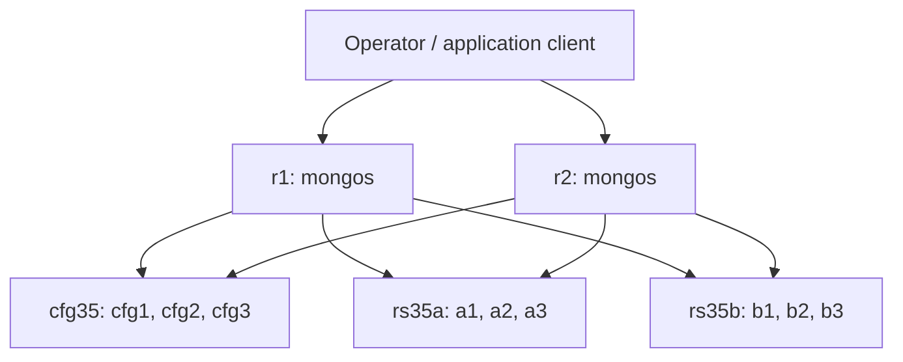

# 35 — Build a Sharded Lab Cluster

**Status:** Written; static review complete; runtime lab validation pending  
**Part:** 5 — Sharding and Scale  
**Goal:** Build a persistent two-shard cluster, verify its control/data planes, shard an empty collection, reconcile routed CRUD and recover from one router outage.  
**Audience:** Developers, Data Engineers, DBREs, SREs and Platform Engineers  
**Time:** 150–180 minutes  
**Baseline:** MongoDB 8.0, mongosh, Docker Engine/Desktop with Linux containers and Docker Compose v2; record exact versions and image digest.  
**Deployment:** New isolated `mongodb-ch35` project: nine `mongod` processes and two `mongos` processes. Community-compatible; Enterprise-only capabilities are outside this lab.  
**Prerequisites:** Chapters 25–34, Docker access, an empty owned lab folder and sufficient CPU, memory and disk. The Chapter 26 `rs26` deployment is separate.

## 1. What this lab proves

**Use case:** An event service needs a working sharded test environment before measuring balancing, routing and resharding behavior. Build the platform first, verify its identity, then exercise application access through routers.

The acceptance contract is a healthy config server replica set, two registered healthy shard replica sets, two reachable routers, correct collection metadata and exact application data after a router restart. Starting eleven containers alone does not meet that contract.

A shard replicates its own data. Adding the second shard introduces another data-placement destination; it does not make shard A a replica of shard B. `mongos` routes requests and combines results. Config servers maintain the cluster catalog and coordination metadata.

## 2. Topology and boundaries



| Component | Services | Replica set / catalog ID | Explicit port | Role |
|---|---|---|---|---|
| Config servers | `cfg1`, `cfg2`, `cfg3` | `cfg35` | 27017 | Dedicated config server replica set |
| First shard | `a1`, `a2`, `a3` | `rs35a` / `shard35a` | 27017 | Application data and shard-local replication |
| Second shard | `b1`, `b2`, `b3` | `rs35b` / `shard35b` | 27017 | Application data and shard-local replication |
| Routers | `r1`, `r2` | No replica set | 27017 | Client-facing routing processes |

Port 27017 is set explicitly everywhere, overriding role-specific defaults. Service DNS names are the advertised member addresses. Run clients on the same Docker network so those names resolve.

This topology uses dedicated config servers. MongoDB 8.0 also supports config shards; this lab does not convert `cfg35` into an application-data shard. All members share one physical Docker host, so three voting members do not demonstrate host/AZ fault tolerance.

## 3. Capacity, security and deployment choices

Reserve approximately 12–16 GiB of Docker memory, several CPU cores and at least 10 GiB of free disk for this small fixture, logs and container overhead. These are lab planning estimates, not production sizing results. Each `mongod` below has a 1 GiB container limit and a 0.25 GiB WiredTiger cache; the limit also covers connections, indexes, other memory and filesystem effects. An OOM kill is a failed lab, not a successful election test.

The cluster network is `internal:true`; no host ports are published. This disposable synthetic lab omits authentication/TLS. Other containers attached to the network can access it, and host administrators can manage it. Do not add production data or attach unrelated services. Production deployment requires authentication, internal member authentication, TLS, least privilege, independent failure domains, backup and monitoring.

Use one exact image digest for every server and client. With an approved Enterprise image, adapt the image source and verify binary/options compatibility separately; the public `mongo` image does not establish Enterprise entitlement.

## 4. Prepare an owned workspace and image

Commands are **Bash**, including Docker Desktop's WSL shell. From a parent folder, create a new `mongodb-ch35` directory; stop if it already contains files. Save the files shown below in that directory and its `scripts` subdirectory.

```bash
mkdir mongodb-ch35
cd mongodb-ch35
mkdir scripts
docker version
docker compose version
docker pull mongo:8.0
docker image inspect mongo:8.0 --format '{{json .RepoDigests}}'
```

Choose the matching `mongo@sha256:...` digest from that output. Set it as `MONGO_IMAGE` in a local `.env` file, for example `MONGO_IMAGE=mongo@sha256:<actual-digest>`, replacing the placeholder. The tag is used only to obtain a baseline image; do not leave a placeholder in `.env`. A future patch release may differ, so retain this file with your evidence.

Define the shell helper and load the nonsecret image reference for independent clients:

```bash
dc() { docker compose -p mongodb-ch35 -f compose.yaml "$@"; }
set -a
source .env
set +a
test -n "$MONGO_IMAGE"
docker ps -a --filter label=com.docker.compose.project=mongodb-ch35
docker volume ls --filter label=com.docker.compose.project=mongodb-ch35
```

For a first build, the project must have no previous containers or volumes. If resources exist, inspect their ownership and decide whether to resume them. Do not delete them to bypass an unexpected-state check.

## 5. Complete Compose configuration

Save as **`compose.yaml`**. Named data and config-directory volumes are separate for each `mongod`. Both routers use the same config replica set seed list. Router startup is deliberately separate from replica-set bootstrap; `depends_on` is not a readiness guarantee.

```yaml
x-mongod: &mongod
  image: ${MONGO_IMAGE:?Set MONGO_IMAGE in .env}
  networks: [cluster]
  mem_limit: 1g
  stop_grace_period: 60s

x-router: &router
  image: ${MONGO_IMAGE:?Set MONGO_IMAGE in .env}
  networks: [cluster]
  mem_limit: 512m
  stop_grace_period: 30s
  command: [mongos, --configdb, 'cfg35/cfg1:27017,cfg2:27017,cfg3:27017', --port, '27017', --bind_ip_all]

services:
  cfg1:
    <<: *mongod
    command: [mongod, --configsvr, --replSet, cfg35, --port, '27017', --bind_ip_all, --wiredTigerCacheSizeGB, '0.25']
    volumes: [cfg1-data:/data/db, cfg1-config:/data/configdb]
  cfg2:
    <<: *mongod
    command: [mongod, --configsvr, --replSet, cfg35, --port, '27017', --bind_ip_all, --wiredTigerCacheSizeGB, '0.25']
    volumes: [cfg2-data:/data/db, cfg2-config:/data/configdb]
  cfg3:
    <<: *mongod
    command: [mongod, --configsvr, --replSet, cfg35, --port, '27017', --bind_ip_all, --wiredTigerCacheSizeGB, '0.25']
    volumes: [cfg3-data:/data/db, cfg3-config:/data/configdb]
  a1:
    <<: *mongod
    command: [mongod, --shardsvr, --replSet, rs35a, --port, '27017', --bind_ip_all, --wiredTigerCacheSizeGB, '0.25']
    volumes: [a1-data:/data/db, a1-config:/data/configdb]
  a2:
    <<: *mongod
    command: [mongod, --shardsvr, --replSet, rs35a, --port, '27017', --bind_ip_all, --wiredTigerCacheSizeGB, '0.25']
    volumes: [a2-data:/data/db, a2-config:/data/configdb]
  a3:
    <<: *mongod
    command: [mongod, --shardsvr, --replSet, rs35a, --port, '27017', --bind_ip_all, --wiredTigerCacheSizeGB, '0.25']
    volumes: [a3-data:/data/db, a3-config:/data/configdb]
  b1:
    <<: *mongod
    command: [mongod, --shardsvr, --replSet, rs35b, --port, '27017', --bind_ip_all, --wiredTigerCacheSizeGB, '0.25']
    volumes: [b1-data:/data/db, b1-config:/data/configdb]
  b2:
    <<: *mongod
    command: [mongod, --shardsvr, --replSet, rs35b, --port, '27017', --bind_ip_all, --wiredTigerCacheSizeGB, '0.25']
    volumes: [b2-data:/data/db, b2-config:/data/configdb]
  b3:
    <<: *mongod
    command: [mongod, --shardsvr, --replSet, rs35b, --port, '27017', --bind_ip_all, --wiredTigerCacheSizeGB, '0.25']
    volumes: [b3-data:/data/db, b3-config:/data/configdb]
  r1:
    <<: *router
  r2:
    <<: *router

networks:
  cluster:
    internal: true

volumes:
  cfg1-data: {}
  cfg1-config: {}
  cfg2-data: {}
  cfg2-config: {}
  cfg3-data: {}
  cfg3-config: {}
  a1-data: {}
  a1-config: {}
  a2-data: {}
  a2-config: {}
  a3-data: {}
  a3-config: {}
  b1-data: {}
  b1-config: {}
  b2-data: {}
  b2-config: {}
  b3-data: {}
  b3-config: {}
```

```bash
dc config
dc up -d cfg1 cfg2 cfg3 a1 a2 a3 b1 b2 b3
dc ps
```

Inspect rendered configuration for the pinned image, distinct volumes and absence of published ports. The project creates network `mongodb-ch35_cluster`. Each process may initially report that its replica set is not initialized; bootstrap comes next.

## 6. Shared readiness and topology checks

Save as **`scripts/lib35.js`**. All subsequent scripts use this file. Direct member connections here are for bootstrap and topology administration, never application collection reads/writes.

```javascript
const sets35 = [
  { name: "cfg35", config: true, hosts: ["cfg1:27017", "cfg2:27017", "cfg3:27017"] },
  { name: "rs35a", config: false, hosts: ["a1:27017", "a2:27017", "a3:27017"] },
  { name: "rs35b", config: false, hosts: ["b1:27017", "b2:27017", "b3:27017"] }
];
function check35(ok, message) { if (!ok) throw new Error(message); }
function wait35(label, test, ms = 120000) {
  const end = Date.now() + ms;
  let last = "not ready";
  while (Date.now() < end) {
    try { if (test()) return; } catch (e) { last = String(e); }
    sleep(1000);
  }
  throw new Error(label + " timed out: " + last);
}
function direct35(host) {
  return new Mongo("mongodb://" + host +
    "/?directConnection=true&serverSelectionTimeoutMS=2000&connectTimeoutMS=2000");
}
function seeded35(spec) {
  return new Mongo("mongodb://" + spec.hosts.join(",") +
    "/?replicaSet=" + spec.name + "&serverSelectionTimeoutMS=5000");
}
function config35(spec, cfg) {
  check35(cfg._id === spec.name && Boolean(cfg.configsvr) === spec.config,
          "Wrong set identity or config server role");
  check35(cfg.members.length === 3, "Unexpected member count");
  for (let i = 0; i < 3; i++) {
    const m = cfg.members.find(x => x._id === i);
    check35(m && m.host === spec.hosts[i] && m.votes === 1 && m.priority === 1 &&
      !m.arbiterOnly && !m.hidden && !m.secondaryDelaySecs, "Unexpected member config");
  }
}
function ready35(spec) {
  const admin = seeded35(spec).getDB("admin");
  const result = admin.runCommand({ replSetGetConfig: 1 });
  check35(result.ok === 1, "Cannot read replica set config");
  config35(spec, result.config);
  const status = admin.runCommand({ replSetGetStatus: 1 });
  if (status.ok !== 1 || status.set !== spec.name || status.members.length !== 3) return false;
  if (status.members.filter(m => m.health === 1 && m.stateStr === "PRIMARY").length !== 1 ||
      status.members.filter(m => m.health === 1 && m.stateStr === "SECONDARY").length !== 2) return false;
  let primary = 0, secondary = 0;
  for (const host of spec.hosts) {
    const h = direct35(host).getDB("admin").runCommand({ hello: 1 });
    if (h.ok !== 1 || h.setName !== spec.name || h.msg === "isdbgrid") return false;
    primary += h.isWritablePrimary === true ? 1 : 0;
    secondary += h.secondary === true ? 1 : 0;
  }
  return primary === 1 && secondary === 2;
}
function router35() {
  check35(db.adminCommand({ hello: 1 }).msg === "isdbgrid", "Connect through mongos");
  const listed = db.adminCommand({ listShards: 1 });
  check35(listed.ok === 1 && listed.shards.length === 2, "Expected exactly two data shards");
  for (const [id, spec] of [["shard35a", sets35[1]], ["shard35b", sets35[2]]]) {
    const shard = listed.shards.find(s => s._id === id);
    check35(shard && shard.host.split("/")[0] === spec.name, "Wrong shard registration");
    check35(JSON.stringify(shard.host.split("/")[1].split(",").sort()) ===
      JSON.stringify([...spec.hosts].sort()), "Wrong shard seed hosts");
  }
  return listed;
}
```

Polling is bounded; preserve the final error if it times out. A retry does not authorize changing unexpected replica configurations. For authenticated environments, bootstrap, replica administration, cluster administration and application CRUD need distinct approved privileges.

## 7. Initialize all three replica sets

Save as **`scripts/bootstrap35.js`**:

```javascript
load("/scripts/lib35.js");
for (const spec of sets35) {
  for (const host of spec.hosts) {
    wait35("ping " + host, () => direct35(host).getDB("admin").runCommand({ ping: 1 }).ok === 1);
  }
  const admin = direct35(spec.hosts[0]).getDB("admin");
  let existing;
  try {
    existing = admin.runCommand({ replSetGetConfig: 1 });
  } catch (e) {
    if (e.code !== 94) throw e;
    existing = { ok: 0, code: e.code, errmsg: String(e) };
  }
  // Only NotYetInitialized permits initiation. Other errors stop the build.
  if (existing.ok !== 1) {
    check35(existing.code === 94, "Unexpected config error: " + EJSON.stringify(existing));
    const cfg = { _id: spec.name, members: spec.hosts.map((host, i) =>
      ({ _id: i, host, votes: 1, priority: 1 })) };
    if (spec.config) cfg.configsvr = true;
    const initiated = admin.runCommand({ replSetInitiate: cfg });
    check35(initiated.ok === 1, "Initiation failed: " + EJSON.stringify(initiated));
  } else {
    config35(spec, existing.config);
  }
  wait35("healthy " + spec.name, () => ready35(spec));
  printjson({ set: spec.name, healthy: true });
}
```

```bash
docker run --rm --network mongodb-ch35_cluster -v "$PWD/scripts:/scripts:ro" "$MONGO_IMAGE" mongosh --nodb --quiet --file /scripts/bootstrap35.js
dc up -d r1 r2
dc logs --tail 60 r1 r2
```

Expected: three `healthy:true` records, then both routers connect to `cfg35`. No preferred primary is required. Existing correct configurations can be resumed; this does not make the fixture creation step safe to replay blindly.

## 8. Register shards and verify routers

Save as **`scripts/register35.js`**:

```javascript
load("/scripts/lib35.js");
wait35("router", () => db.adminCommand({ hello: 1 }).msg === "isdbgrid");
const before35 = db.adminCommand({ listShards: 1 });
check35(before35.ok === 1, "Cannot list shards");
check35(before35.shards.every(s => ["shard35a", "shard35b"].includes(s._id)),
        "Unexpected existing shard; inspect before continuing");
for (const [id, spec] of [["shard35a", sets35[1]], ["shard35b", sets35[2]]]) {
  if (!before35.shards.some(s => s._id === id)) {
    const added = db.adminCommand({ addShard: spec.name + "/" + spec.hosts.join(","), name: id });
    check35(added.ok === 1, "addShard failed: " + EJSON.stringify(added));
  }
}
printjson(router35());
printjson({ server: db.version(), shell: version(), router: db.adminCommand({ hello: 1 }) });
```

```bash
docker run --rm --network mongodb-ch35_cluster -v "$PWD/scripts:/scripts:ro" "$MONGO_IMAGE" mongosh 'mongodb://r1:27017/?serverSelectionTimeoutMS=5000' --quiet --file /scripts/register35.js
docker run --rm --network mongodb-ch35_cluster -v "$PWD/scripts:/scripts:ro" "$MONGO_IMAGE" mongosh 'mongodb://r2:27017/?serverSelectionTimeoutMS=5000' --quiet --eval 'load("/scripts/lib35.js"); printjson(router35());'
```

Expected: `hello.msg` is `isdbgrid` on both routers, and `listShards` contains exactly `shard35a` and `shard35b`. `cfg35` is not listed as a data shard. Do not insert application documents through an `a*`, `b*` or `cfg*` connection.

## 9. Create and shard an empty fixture collection

Connect to `r1`; sections 9–11 run sequentially in this **same mongosh session**:

```bash
docker run --rm -it --network mongodb-ch35_cluster -v "$PWD/scripts:/scripts:ro" "$MONGO_IMAGE" mongosh 'mongodb://r1:27017,r2:27017/?serverSelectionTimeoutMS=5000'
```

This is a multiple-router URI, not a replica-set URI; there is no `replicaSet` option for `mongos`. Driver selection/retry behavior must be tested with the application's actual driver later.

```javascript
load("/scripts/lib35.js");
router35();
for (const spec of sets35) wait35("preflight " + spec.name, () => ready35(spec));
const name35 = "mongodb_enterprise_tutorial_ch35";
const ns35 = name35 + ".events";
const lab35 = db.getSiblingDB(name35);
const wc35 = { w: "majority", j: true, wtimeout: 10000 };
check35(lab35.getCollectionNames().length === 0, "Owned database already has collections; inspect rerun");
check35(lab35.createCollection("events").ok === 1, "Create failed");
const events35 = lab35.events;
events35.createIndex({ eventId: "hashed" }, { name: "event_hash" });
const sharded35 = db.adminCommand({ shardCollection: ns35, key: { eventId: "hashed" } });
check35(sharded35.ok === 1, "Sharding failed: " + EJSON.stringify(sharded35));
printjson(sharded35);
const metadata35 = db.getSiblingDB("config").collections.findOne({ _id: ns35 });
check35(metadata35 && metadata35.key.eventId === "hashed" && metadata35.uuid &&
        metadata35.unsplittable !== true, "Expected sharded collection metadata");
printjson(metadata35);
```

This single-field hashed key is a platform demonstration, not the tenant-service key recommendation from Chapter 34. It keeps initial placement simple; the next chapters analyze workload-specific choices. The collection is empty when sharded and has an explicit supporting hashed index. No `unique:true` is requested. MongoDB 8.0 does not require `enableSharding` before `shardCollection`.

## 10. Insert, query and reconcile through mongos

```javascript
const fixture35 = Array.from({ length: 1000 }, (_, i) => ({
  _id: "event-" + String(i).padStart(4, "0"),
  eventId: "event-" + String(i).padStart(4, "0"),
  tenantId: "tenant-" + (i % 10), seq: i, revision: 1,
  createdAt: new Date(Date.UTC(2026, 0, 1) + i * 1000)
}));
const inserted35 = events35.insertMany(fixture35, { ordered: true, writeConcern: wc35 });
check35(inserted35.acknowledged && Object.keys(inserted35.insertedIds).length === 1000,
        "Insert acknowledgement mismatch");
check35(events35.countDocuments({}) === 1000, "Total mismatch");
check35(events35.countDocuments({ tenantId: "tenant-3" }) === 100, "Tenant mismatch");
const found35 = events35.findOne({ eventId: "event-0042" });
check35(found35 && found35.seq === 42 && found35.tenantId === "tenant-2", "Lookup mismatch");
const changed35 = events35.updateOne({ eventId: "event-0042", _id: "event-0042", revision: 1 },
  { $set: { revision: 2 } }, { writeConcern: wc35 });
check35(changed35.matchedCount === 1 && changed35.modifiedCount === 1, "Update mismatch");
const sums35 = events35.aggregate([{ $group: { _id: null, n: { $sum: 1 },
  seqSum: { $sum: "$seq" }, revisions: { $sum: "$revision" } } }]).toArray()[0];
check35(sums35.n === 1000 && sums35.seqSum === 499500 && sums35.revisions === 1001,
        "Aggregate reconciliation mismatch");
printjson(sums35);
```

All fixture IDs are generated once, and every update contains the full shard-key value. In a production sharded collection whose `_id` is not the shard key, the default `_id` index alone does not supply a cluster-wide uniqueness contract; the application must generate unique IDs or use a compatible uniqueness design.

After a timeout or partial insert, inspect IDs and persisted values before replaying. `wtimeout` does not undo writes. The exact reconciliations below are stronger than assuming that a successful retry means the original batch never ran.

## 11. Inspect placement and routing evidence

```javascript
const chunks35 = db.getSiblingDB("config").chunks.find({ uuid: metadata35.uuid }).toArray();
check35(chunks35.length > 0 && chunks35.every(c => ["shard35a", "shard35b"].includes(c.shard)),
        "Unexpected chunk catalog");
printjson(chunks35.map(c => ({ shard: c.shard, min: c.min, max: c.max })));
printjson({ owners: [...new Set(chunks35.map(c => c.shard))].sort(), chunks: chunks35.length });
events35.getShardDistribution();
printjson(events35.find({ eventId: "event-0042" }).explain("executionStats"));
printjson(events35.find({ tenantId: "tenant-3" }).explain("executionStats"));
sh.status();
```

Read the catalog through `mongos` and never edit `config.collections` or `config.chunks`. On this baseline, chunks are associated with collection UUID, not a guessed `ns` field. Record actual chunk owners and distribution output. An empty hashed collection can receive initial ranges on multiple shards; do not assert a fixed chunk count or an exact 500/500 document split.

Locate participating shard names in the explain output for the exact event equality and tenant-only predicate. Expect the event key to provide targeted routing, while the tenant-only predicate lacks a shard-key bound. Explain layout differs by version/execution engine; inspect the real output rather than hardcoding one tree path. A chunk-owner list is placement evidence, not proof of actual query fan-out or balanced QPS. If the lab has only one current chunk owner, record that limitation before claiming a multi-owner routing comparison; investigate placement in Chapter 36.

Exit this mongosh session before the shell-driven outage exercise.

## 12. Failure exercise: one router unavailable

**Trigger:** Stop only `r1`. **Expected symptom:** A fresh client pinned to `r1` cannot connect. **Diagnosis:** `r2` remains reachable, all three replica sets remain healthy and both shards remain registered. **Repair:** Start the same router and recheck data through both endpoints.

Save **`scripts/verify35.js`**. This script is read-only and usable before, during and after the outage. Pass the expected document count, `1000` or `1001`, via the shell environment.

```javascript
load("/scripts/lib35.js");
router35();
for (const spec of sets35) wait35("verify " + spec.name, () => ready35(spec));
const expected35 = Number(process.env.EXPECTED_COUNT);
check35([1000, 1001].includes(expected35), "Set EXPECTED_COUNT to 1000 or 1001");
const coll35 = db.getSiblingDB("mongodb_enterprise_tutorial_ch35").events;
const actual35 = coll35.find({}).sort({ seq: 1 }).toArray();
check35(actual35.length === expected35, "Wrong total");
for (let i = 0; i < 1000; i++) {
  const id = "event-" + String(i).padStart(4, "0");
  const doc = actual35[i];
  check35(doc._id === id && doc.eventId === id && doc.seq === i &&
    doc.tenantId === "tenant-" + (i % 10) && doc.revision === (i === 42 ? 2 : 1) &&
    doc.createdAt.getTime() === Date.UTC(2026, 0, 1) + i * 1000, "Fixture mismatch at " + i);
}
if (expected35 === 1001) {
  const mark = actual35[1000];
  check35(mark._id === "router-outage-marker" && mark.eventId === mark._id &&
    mark.seq === 1000 && mark.tenantId === "ops-lab" && mark.revision === 1,
    "Marker mismatch");
}
printjson({ verified: true, documents: expected35, router: db.getMongo().toString() });
```

Save **`scripts/outage-write35.js`**; it performs exactly one majority-acknowledged application write through `r2`:

```javascript
load("/scripts/lib35.js");
router35();
const target35 = db.getSiblingDB("mongodb_enterprise_tutorial_ch35").events;
check35(target35.countDocuments({}) === 1000 &&
  !target35.findOne({ eventId: "router-outage-marker" }), "Unexpected pre-write state; reconcile first");
const marker35 = target35.insertOne({ _id: "router-outage-marker", eventId: "router-outage-marker",
  seq: 1000, tenantId: "ops-lab", revision: 1 },
  { writeConcern: { w: "majority", j: true, wtimeout: 10000 } });
check35(marker35.acknowledged, "Marker not acknowledged");
printjson(marker35);
```

In the original Bash session, run one command at a time and preserve outputs:

```bash
docker run --rm --network mongodb-ch35_cluster -e EXPECTED_COUNT=1000 -v "$PWD/scripts:/scripts:ro" "$MONGO_IMAGE" mongosh 'mongodb://r2:27017/?serverSelectionTimeoutMS=5000' --quiet --file /scripts/verify35.js
trap 'dc start r1' EXIT INT TERM
dc stop r1
dc ps -a
docker run --rm --network mongodb-ch35_cluster "$MONGO_IMAGE" mongosh 'mongodb://r1:27017/?serverSelectionTimeoutMS=3000&connectTimeoutMS=2000' --quiet --eval 'printjson(db.adminCommand({ping:1}))'
```

The last command must fail with connection/server-selection evidence attributable to stopped `r1`. Inspect the error: Docker image/network/CLI failures do not prove the intended MongoDB outage. If it succeeds, stop the exercise and inspect endpoint/project identity. Do not run this sequence under `set -e` without explicitly handling the expected failure. The trap is a best-effort recovery aid, not protection against host failure or `SIGKILL`.

```bash
docker run --rm --network mongodb-ch35_cluster -e EXPECTED_COUNT=1000 -v "$PWD/scripts:/scripts:ro" "$MONGO_IMAGE" mongosh 'mongodb://r2:27017/?serverSelectionTimeoutMS=5000' --quiet --file /scripts/verify35.js
docker run --rm --network mongodb-ch35_cluster -v "$PWD/scripts:/scripts:ro" "$MONGO_IMAGE" mongosh 'mongodb://r2:27017/?serverSelectionTimeoutMS=5000' --quiet --file /scripts/outage-write35.js
docker run --rm --network mongodb-ch35_cluster -e EXPECTED_COUNT=1001 -v "$PWD/scripts:/scripts:ro" "$MONGO_IMAGE" mongosh 'mongodb://r2:27017/?serverSelectionTimeoutMS=5000' --quiet --file /scripts/verify35.js
dc start r1
dc logs --tail 60 r1
docker run --rm --network mongodb-ch35_cluster -e EXPECTED_COUNT=1001 -v "$PWD/scripts:/scripts:ro" "$MONGO_IMAGE" mongosh 'mongodb://r1:27017/?serverSelectionTimeoutMS=5000' --quiet --file /scripts/verify35.js
docker run --rm --network mongodb-ch35_cluster -e EXPECTED_COUNT=1001 -v "$PWD/scripts:/scripts:ro" "$MONGO_IMAGE" mongosh 'mongodb://r2:27017/?serverSelectionTimeoutMS=5000' --quiet --file /scripts/verify35.js
trap - EXIT INT TERM
```

Router startup may require a short readiness wait; retry the **read-only** verifier within a bounded window after inspecting logs. If the marker write times out, reconcile its persisted state on `r2`; do not blindly replay the insert. If a read-only verifier fails, preserve the cluster and fix the cause before cleanup.

This exercise proves continuity via the surviving endpoint and recovery of the stopped router. It does not prove automatic retry by an application driver, shard-primary failover, config quorum-loss behavior or a host disaster. Those need separate controlled drills.

## 13. Troubleshooting

| Symptom | Evidence | Likely cause | Corrective action |
|---|---|---|---|
| Docker cannot start eleven processes | `dc ps -a`, inspect exit/OOM state, host resources | Insufficient memory, disk or incompatible architecture | Correct host capacity/image; retain data volumes |
| `replSetInitiate` fails | Exact response and member logs | Role/name mismatch, prior config, unreachable member | Compare flags, DNS and config; never force a reconfig to bypass diagnosis |
| Config set cannot elect | Status on cfg members, logs, disk | Fewer than two voting members reachable | Restore original members/storage/network |
| Router exits or cannot start | `dc logs r1 r2`, cfg health | Bad configdb string or unhealthy config set | Repair seeds and cfg readiness before clients |
| `addShard` fails | Response, shard status, router logs | Wrong set name, role, DNS or duplicate registration | Check expected `rs35a`/`rs35b` and `--shardsvr` |
| Client gets replica-set hello | `hello.msg`, URI | Client connected to a shard | Reconnect through r1/r2; reconcile any unintended direct writes |
| Host mongosh cannot resolve a1/cfg1 | DNS and network location | Docker-only advertised hostnames | Use the network-attached client; do not rewrite members to localhost |
| Fixture count/sum differs | Full ID/value comparison | Partial write, rerun or unintended mutation | Reconcile known IDs and uncertainty; do not mask with a new fixture |
| Tiny fixture appears uneven | Actual chunk/document/byte stats | Hash distribution, initial placement or sample size | Record observations; do not equate unequal counts with a broken balancer |
| r1 outage also breaks r2 | r2 hello, all set statuses, resource/OOM events | Shared dependency or host-resource failure | Restore dependency; classify exercise as failed |
| Restarted router returns stale/error result | Logs, metadata and verifier | Router not ready or underlying set problem | Bound retries, inspect control/data plane, preserve evidence |

## 14. Production operating considerations

Use independent hosts/AZs for voting members and redundant routers with application driver discovery and suitable pool limits. Size each shard from bytes, growth, working set, QPS, write rate, replication and migration overhead. Adding shards does not remove a hot key or an inefficient local query.

Monitor per-shard replication lag, elections, disk latency/free space, WiredTiger pressure and application latency, plus router errors and config-server health. Track chunk movement and orphan cleanup separately from logical application counts. A router is stateless with respect to application storage, but its outage can still affect sessions/connections and in-flight work.

Treat the config catalog and all shards as one recovery system. Named Docker volumes are persistence, not backups. Test coherent backup/restore and RPO/RTO before production use. Never restore only arbitrary config files or one shard volume into a live cluster and assume consistency.

Use administrative connections to members only for necessary maintenance with appropriate privileges. MongoDB 8.0 restricts direct shard operations; an application must use `mongos`. Do not grant broad direct-shard privileges just to simplify application access.

## 15. Cleanup, retained lab and rollback

First restore `r1` and pass both 1001-document verifiers. Capture configuration/version, topology, fixture, explain and failure evidence before removing anything.

**Continue to Chapter 36:** Retain all original volumes and collection data. To pause the lab:

```bash
dc stop
```

To resume it, start data/config members, run `bootstrap35.js` to validate existing configs, then start routers and run `register35.js` and both read-only verifiers. Do not recreate the fixture. The bootstrap script accepts only the original topology and will not force reconfiguration.

**Remove only Chapter 35 application data:** With restored routers, connect to `mongos` and run:

```javascript
load("/scripts/lib35.js");
router35();
const cleanup35 = db.getSiblingDB("mongodb_enterprise_tutorial_ch35");
check35(cleanup35.getCollectionNames().every(n => n === "events"), "Unexpected collections; preserve database");
check35(cleanup35.dropDatabase().ok === 1, "Drop failed");
check35(cleanup35.getCollectionNames().length === 0, "Namespace cleanup incomplete");
```

Record the drop result and confirm the namespace through both routers. Leave cluster/system databases intact. Removing the fixture means the next chapter must explicitly rebuild its prerequisite data.

**Fully remove this disposable project:** Only after evidence is saved and you intentionally no longer need its data:

```bash
dc ps -a
docker volume ls --filter label=com.docker.compose.project=mongodb-ch35
dc down -v
docker ps -a --filter label=com.docker.compose.project=mongodb-ch35
docker volume ls --filter label=com.docker.compose.project=mongodb-ch35
```

`down -v` irreversibly removes this project's declared named volumes. It is not a rollback command and must not be used when diagnosing a cluster you need to recover. Do not run global Docker prune commands. Keep the local `.env`, scripts and evidence; do not alter Chapter 26 resources.

There is no in-place “unshard everything” rollback for this setup. Rollback of the router outage is `dc start r1`; rollback of a discarded fixture is reconstruction from its deterministic definition on an owned clean namespace. Recovery of valuable data requires a validated backup.

## 16. Acceptance and review

- [ ] Recorded host/Docker/Compose/mongosh/server versions and pinned image digest.
- [ ] Rendered Compose has eleven services, nine distinct data volumes, no published ports and the isolated project network.
- [ ] All three replica sets have the original three voting data-bearing members, one primary and two secondaries.
- [ ] Both routers identify as `isdbgrid`; exactly two expected data shards are registered.
- [ ] Fixture collection is sharded on `{eventId:"hashed"}` with its supporting index and UUID metadata.
- [ ] Reconciled 1000 fixture documents, tenant count 100, seq sum 499500 and revision sum 1001.
- [ ] Recorded actual placement/distribution and real query explain evidence without inventing balance/target counts.
- [ ] Classified the stopped-r1 connection failure, verified surviving r2 and acknowledged/reconciled its marker.
- [ ] Restored r1 and verified all 1001 documents through both routers with healthy original replica sets.
- [ ] Chose retained lab, scoped fixture cleanup or intentional project teardown and verified that result.

**Evidence:** Rendered configuration, digest/version inventory, bootstrap outputs, both router hello/listShards, read-only replica topology, sharding/index/catalog results, CRUD reconciliation, distribution/explain output, stopped-router error, marker acknowledgement and both final verifiers. Record actual durations and any failed assertions. Static parsing alone does not satisfy runtime acceptance.

**Review questions:**

1. Why must the config and shard replica sets have different names?
2. What does a successful `ping` fail to establish about cluster readiness?
3. Why does the client URI list routers without a `replicaSet` parameter?
4. What risk comes from inserting application documents directly into one shard?
5. Why can logical counts, chunk counts, stored bytes and QPS tell different stories?
6. What does the router outage prove, and what remains untested?
7. Why do nine members on one Docker host not provide production failure isolation?
8. How would you reconcile an uncertain marker write before repeating it?
9. Why are persistent volumes insufficient as a backup/recovery plan?

## 17. Official references

- [MongoDB 8.0: deploy a self-managed sharded cluster](https://www.mongodb.com/docs/v8.0/tutorial/deploy-shard-cluster/)
- [MongoDB 8.0: addShard](https://www.mongodb.com/docs/v8.0/reference/command/addShard/)
- [MongoDB 8.0: shardCollection](https://www.mongodb.com/docs/v8.0/reference/command/shardCollection/)
- [MongoDB 8.0: hashed sharding](https://www.mongodb.com/docs/v8.0/core/hashed-sharding/)
- [MongoDB 8.0: sharded cluster administration](https://www.mongodb.com/docs/v8.0/administration/sharded-cluster-administration/)
- [Docker: Compose file reference](https://docs.docker.com/reference/compose-file/)

---

Previous: [Chapter 34 — Shard Key Selection and Workload Analysis](34-shard-key-selection-and-workload-analysis.md)  
Next: **[Chapter 36 — Chunk Distribution Balancing and Zones](36-chunk-distribution-balancing-and-zones.md)**.
