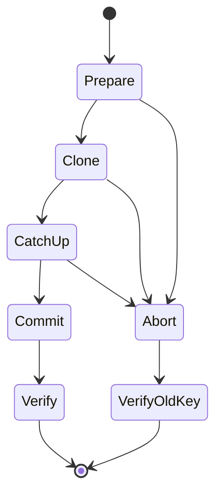

# 38 — Resharding and Shard Key Refinement

**Status:** Written; static review complete; runtime lab validation pending  
**Part:** 5 — Sharding and Scale  
**Goal:** Distinguish key refinement from resharding, repair a missing refinement index, verify unchanged placement after refinement, execute a monitored key replacement and restore shared maintenance state.  
**Audience:** Developers, Data Engineers, DBREs, SREs and Platform Engineers  
**Time:** 150–180 minutes, including the baseline resharding duration and observation.  
**Baseline:** MongoDB 8.0 and mongosh; reuse and record the Chapter 35 image digest, exact patch versions and FCV.  
**Deployment:** Retained isolated `mongodb-ch35` cluster; two routers, dedicated `cfg35`, data shards `shard35a`/`shard35b`. Community-compatible.  
**Prerequisites:** Chapters 33–37, healthy original topology and Chapter 35's 1001-document fixture, Chapter 37 cleanup completed, exclusive use of this disposable cluster during maintenance, adequate temporary storage/CPU/I/O/oplog headroom, and approved cluster management/monitoring plus scoped CRUD privileges where authentication applies.

## 1. Choose the operation from the required change

**Use case:** A tenant event collection originally uses `{tenantId:1}`. One tenant has many distinct events but the original key treats its tenant value as indivisible. Another service needs event-ID point routing even when tenant identity is unavailable. These are different changes and should not be treated as the same operation.

| Need | Operation | What changes |
|---|---|---|
| Keep the existing prefix and append event granularity | Refine `{tenantId:1}` to `{tenantId:1,eventId:1}` | Key/catalog bounds gain a suffix; data placement is initially retained |
| Replace/reorder the key or change an existing field's ranged/hashed type | Reshard, subject to exact-version constraints | New distribution is built and committed |
| Redistribute using the same key in MongoDB 8.0 | Reshard with `forceRedistribution:true` | Distribution can change without changing the key pattern |
| Change one document's shard-key value | Supported document update procedure | Different operation; not covered by this collection-key lab |

Refinement cannot remove/reorder the existing prefix or convert an existing ranged field to hashed. It creates finer potential granularity, not immediate throughput or balance. Resharding is a coordinated data-copy/catch-up/commit operation, not a metadata-only index change.

This lab uses two independent collections: `refine_events` and `reshard_events`. Both start with the same 600-event workload, but their IDs include a collection-specific prefix. No original Chapter 35 application collection is refined or resharded.

## 2. Preconditions and production tradeoffs

| Review area | Evidence before execution |
|---|---|
| Key/data suitability | Scalar populated fields, cardinality/frequency, intended query/write predicates |
| Index/uniqueness contract | Supporting index for refinement; legal unique indexes and globally unique `_id` values for resharding |
| Version/FCV | Exact binaries, shell and FCV; patch-specific options/limitations |
| Resources | Recipient free space, temporary data/index overhead, CPU/I/O, lag and oplog retention |
| Concurrent activity | No competing index build, key change, migration, topology change or DDL exercise |
| Application behavior | Retry/timeout semantics, changed key predicates and possible commit write blocking |
| Recovery | Evidence, operation monitoring, pre-commit abort boundary and post-commit recovery plan |

For refinement, create the qualifying new-key index first. For resharding, the server can build the new shard-key index as part of the operation; this lab lets it do so. Existing uniqueness restrictions, multikey fields, collation, zones, encrypted/time-series collections and external indexes require separate compatibility review. These are ordinary nonunique synthetic collections with simple collation and no zones.

The small fixture does not prove production capacity. Review MongoDB's resource guidance for the exact version, then size for actual recipient distribution, indexes, temporary copies, oplog and workload headroom. Do not interpret a uniform average allocation formula as a guarantee for a skewed recipient. No process parameter, oplog setting or range-size threshold is changed here.

## 3. Resharding lifecycle and rollback boundary



The coordinator manages donor/recipient work; a shard can perform both roles. Application writes may continue during substantial portions of the operation, but commit requires a write-blocking interval. Its duration/threshold is patch-dependent; do not promise zero downtime or exactly two seconds.

Budget at least the documented baseline five-minute resharding duration even for this tiny fixture. The lab does not shorten that duration with an internal parameter or force early commit. Monitor operation state rather than assuming a quiet shell means a hang.

An abort is available before commit. Once commit has begun, abort can be rejected. Closing the client, killing its container or reaching a client timeout is not an undo command. After successful commit, returning to the old key requires another supported migration/recovery procedure, not refinement with a shorter key.

## 4. Verify the retained environment

Use **Bash** in the original `mongodb-ch35` folder with `.env`, `compose.yaml`, `scripts/lib35.js` and `scripts/verify35.js`. Resume the retained cluster using earlier procedures if needed. Rebuild Chapter 35 fully if its original data was discarded.

```bash
dc() { docker compose -p mongodb-ch35 -f compose.yaml "$@"; }
set -a
source .env
set +a
dc ps -a
docker run --rm --network mongodb-ch35_cluster -e EXPECTED_COUNT=1001 -v "$PWD/scripts:/scripts:ro" "$MONGO_IMAGE" mongosh 'mongodb://r1:27017/?serverSelectionTimeoutMS=5000' --quiet --file /scripts/verify35.js
docker run --rm --network mongodb-ch35_cluster -e EXPECTED_COUNT=1001 -v "$PWD/scripts:/scripts:ro" "$MONGO_IMAGE" mongosh 'mongodb://r2:27017/?serverSelectionTimeoutMS=5000' --quiet --file /scripts/verify35.js
dc stats --no-stream
docker system df
```

Inspect Docker host/volume free space as well as container memory/OOM state. `docker system df` reports Docker usage, not sufficient recipient free space or I/O headroom. Record real host filesystem and resource observations; stop if capacity is uncertain or inadequate.

The resharding portion temporarily changes **global balancing on this owned training cluster**. Every collection in the project is affected while it is paused. Exclusive lab use is required; do not transplant this sequence into a shared production maintenance window without its own reviewed plan.

## 5. Shared fixture, metadata and monitoring helpers

Save **`scripts/lib38.js`**:

```javascript
load("/scripts/lib35.js");
const name38 = "mongodb_enterprise_tutorial_ch38";
const lab38 = db.getSiblingDB(name38);
const catalog38 = db.getSiblingDB("config");
const refineNs38 = name38 + ".refine_events";
const reshardNs38 = name38 + ".reshard_events";
const wc38 = { w: "majority", j: true, wtimeout: 10000 };
function equal38(a, b) { return EJSON.stringify(a) === EJSON.stringify(b); }
function event38(i) { return "event-" + String(i).padStart(4, "0"); }
function fixture38(label) {
  return Array.from({ length: 600 }, (_, i) => ({
    _id: label + "-" + String(i).padStart(4, "0"), eventId: event38(i),
    tenantId: "tenant-" + Math.floor(i / 60), seq: i, revision: 1, payload: "x".repeat(128)
  }));
}
function meta38(ns) {
  check35([refineNs38, reshardNs38].includes(ns), "Namespace outside chapter");
  const m = catalog38.collections.findOne({ _id: ns });
  check35(m && m.uuid && m.unsplittable !== true, "Missing sharded metadata");
  return m;
}
function chunks38(ns) { return catalog38.chunks.find({ uuid: meta38(ns).uuid }).toArray(); }
function verify38(collection, label) {
  check35(["refine_events", "reshard_events"].includes(collection), "Unexpected collection");
  const docs = lab38.getCollection(collection).find({}).sort({ seq: 1 }).maxTimeMS(10000).toArray();
  const expected = fixture38(label);
  check35(docs.length === 600, "Wrong fixture count");
  for (let i = 0; i < 600; i++) {
    for (const field of ["_id", "eventId", "tenantId", "seq", "revision", "payload"]) {
      check35(docs[i][field] === expected[i][field], "Fixture mismatch at " + i + "/" + field);
    }
  }
  check35(new Set(docs.map(d => d._id)).size === 600 &&
    docs.reduce((sum, d) => sum + d.seq, 0) === 179700, "ID/sum mismatch");
  return { collection, count: 600, seqSum: 179700, tenantCounts: Array.from({ length: 10 }, (_, t) =>
    docs.filter(d => d.tenantId === "tenant-" + t).length) };
}
function checkpoint38(fields) {
  const r = lab38.control.updateOne({ _id: "ownership" }, { $set: fields }, { writeConcern: wc38 });
  check35(r.matchedCount === 1, "Ownership checkpoint missing");
}
function active38() {
  return db.getSiblingDB("admin").aggregate([
    { $currentOp: { allUsers: true, localOps: false } },
    { $match: { $or: [
      { "originatingCommand.reshardCollection": { $exists: true } },
      { "command.reshardCollection": { $exists: true } },
      { desc: /Resharding.*Service/ }
    ] } }
  ]).toArray();
}
function otherBalancerFields38(doc) {
  const copy = { ...(doc || {}) };
  delete copy._id;
  delete copy.stopped;
  return copy;
}
function names38(tree) {
  const found = new Set();
  function walk(v) {
    if (!v || typeof v !== "object") return;
    if (typeof v.shardName === "string") found.add(v.shardName);
    for (const [k, value] of Object.entries(v)) {
      if (!["rejectedPlans", "allPlansExecution"].includes(k)) walk(value);
    }
  }
  walk(tree);
  return [...found].sort();
}
function explain38(collection, filter, expectedTargets, expectedReturned) {
  const raw = lab38.getCollection(collection).find(filter).maxTimeMS(10000).explain("executionStats");
  printjson(raw);
  const planned = names38(raw.queryPlanner && raw.queryPlanner.winningPlan);
  const executed = names38(raw.executionStats && raw.executionStats.executionStages);
  check35(planned.length > 0 && equal38(planned, executed), "Inspect unsupported/mismatched explain layout");
  check35(planned.length === expectedTargets && raw.executionStats.nReturned === expectedReturned,
          "Routing/result expectation failed");
  return { planned, executed, returned: raw.executionStats.nReturned };
}
```

`active38()` is an operational view, not a complete proof of coordinator absence. Later gates also require command outcome, expected key, absent `reshardingFields` and exact data verification. Missing/inaccessible monitoring evidence is not an empty-state assertion. The explain helper follows winning/executed trees and fails if the format requires review.

## 6. Establish ownership, versions and two starting collections

Connect to `mongos`. Sections 6–9 use this same interactive session:

```bash
docker run --rm -it --network mongodb-ch35_cluster -v "$PWD/scripts:/scripts:ro" "$MONGO_IMAGE" mongosh 'mongodb://r1:27017,r2:27017/?readPreference=primary&serverSelectionTimeoutMS=5000'
```

```javascript
load("/scripts/lib38.js");
router35();
for (const spec of sets35) {
  wait35("preflight " + spec.name, () => ready35(spec));
  const admin = seeded35(spec).getDB("admin");
  const cfg = admin.runCommand({ replSetGetConfig: 1 });
  check35(cfg.ok === 1 && cfg.config.writeConcernMajorityJournalDefault !== false,
          "Majority journal policy unsuitable");
  const fcv = admin.runCommand({ getParameter: 1, featureCompatibilityVersion: 1 });
  check35(fcv.ok === 1 && fcv.featureCompatibilityVersion.version === "8.0" &&
    !fcv.featureCompatibilityVersion.targetVersion, "FCV not stable 8.0; do not change it in this lab");
  printjson({ set: spec.name, version: admin.version(), fcv: fcv.featureCompatibilityVersion });
}
check35(typeof sh.isAutoMergerEnabled === "function", "Shell lacks required AutoMerger state helper");
check35(lab38.getCollectionNames().length === 0 &&
  !catalog38.collections.findOne({ _id: { $in: [refineNs38, reshardNs38] } }), "Existing chapter namespace");
check35(db.getSiblingDB("mongodb_enterprise_tutorial_ch37").getCollectionNames().length === 0,
        "Complete Chapter 37 cleanup first");
check35(catalog38.tags.countDocuments({ ns: { $in: [refineNs38, reshardNs38] } }) === 0,
        "Unexpected chapter zone ranges");
check35(active38().length === 0, "Another resharding operation is active");
const original38 = {
  _id: "ownership", namespaces: [refineNs38, reshardNs38], phase: "owned",
  globalBalancer: sh.getBalancerState(), globalAutoMerger: sh.isAutoMergerEnabled(),
  otherBalancerFields: otherBalancerFields38(catalog38.settings.findOne({ _id: "balancer" })),
  shardTags: catalog38.shards.find({}).toArray().map(s => ({ shard: s._id, tags: [...(s.tags || [])].sort() })),
  globalPauseIntent: false, reshardSubmitted: false,
  priorCollectionBalancing: true, priorAutoMerger: true
};
check35(typeof original38.globalBalancer === "boolean" && typeof original38.globalAutoMerger === "boolean",
        "Unknown maintenance policy state");
check35(lab38.control.insertOne(original38, { writeConcern: wc38 }).acknowledged, "Ownership record failed");
for (const [collection, label] of [["refine_events", "refine"], ["reshard_events", "reshard"]]) {
  check35(lab38.createCollection(collection).ok === 1, "Create failed");
  const coll = lab38.getCollection(collection);
  coll.createIndex({ tenantId: 1 }, { name: "tenant_key" });
  const ns = name38 + "." + collection;
  const sharded = db.adminCommand({ shardCollection: ns, key: { tenantId: 1 } });
  check35(sharded.ok === 1, "Initial sharding failed");
  sh.disableBalancing(ns);
  check35(meta38(ns).noBalance === true, "Collection pause failed");
  check35(db.adminCommand({ configureCollectionBalancing: ns, enableAutoMerger: false }).ok === 1,
          "Collection AutoMerger pause failed");
  const inserted = coll.insertMany(fixture38(label), { ordered: true, writeConcern: wc38 });
  check35(inserted.acknowledged && Object.keys(inserted.insertedIds).length === 600, "Partial insertion");
  const split = sh.splitAt(ns, { tenantId: "tenant-5" });
  check35(split.ok === 1, "Initial split failed");
  for (const [min, max, to] of [
    [{ tenantId: MinKey }, { tenantId: "tenant-5" }, "shard35a"],
    [{ tenantId: "tenant-5" }, { tenantId: MaxKey }, "shard35b"]
  ]) {
    const chunk = chunks38(ns).find(c => equal38(c.min, min) && equal38(c.max, max));
    check35(chunk, "Expected original range");
    if (chunk.shard !== to) check35(db.adminCommand({ moveChunk: ns, bounds: [chunk.min, chunk.max], to }).ok === 1,
      "Initial placement failed");
  }
  printjson(verify38(collection, label));
}
checkpoint38({ phase: "fixtures-ready", refineUUID: meta38(refineNs38).uuid,
  oldReshardUUID: meta38(reshardNs38).uuid });
printjson(original38);
```

Save the ownership record externally. Default journal policy is accepted only when it is not explicitly disabled; the server's exact configuration/version is captured. FCV transitions are a stop condition, not a reason to upgrade/downgrade this lab automatically.

Before resharding, inspect index-build/current operations on the config/data members as well as the router. Use approved direct **administrative** connections for `getParameter`, replica readiness and member monitoring; all collection reads/writes remain through `mongos`. The completed index creates above are synchronous, but do not assume that excludes unrelated background work in a shared environment.

## 7. Failure exercise: missing refinement supporting index

The first collection intentionally has only `_id` and `{tenantId:1}` indexes. Attempting to append `eventId` without a suitable compound index must fail; the failure must leave the old key and data intact.

```javascript
const beforeRefine38 = meta38(refineNs38);
const beforeRefineMap38 = chunks38(refineNs38).map(c => ({ min: c.min, max: c.max, shard: c.shard }));
check35(!lab38.refine_events.getIndexes().some(i => i.key.tenantId === 1 && i.key.eventId === 1),
        "Failure setup already has supporting index");
let missingIndex38 = null;
try {
  const result = db.adminCommand({ refineCollectionShardKey: refineNs38, key: { tenantId: 1, eventId: 1 } });
  if (result.ok !== 1) missingIndex38 = result;
} catch (e) {
  missingIndex38 = { code: e.code, codeName: e.codeName, errmsg: String(e) };
}
check35(missingIndex38 && ![13, 18].includes(missingIndex38.code) &&
  /index/i.test(missingIndex38.errmsg || "") &&
  /support|could not find|not found|no.*index/i.test(missingIndex38.errmsg || ""),
  "Expected missing supporting-index evidence; preserve actual response");
printjson(missingIndex38);
check35(equal38(meta38(refineNs38).key, { tenantId: 1 }) &&
  equal38(meta38(refineNs38).uuid, beforeRefine38.uuid), "Failed refinement changed identity/key");
printjson(verify38("refine_events", "refine"));
```

Record the actual error code/name/message rather than assuming one code across versions. An authorization, network, collation or multikey failure does not satisfy this exercise. If the command unexpectedly succeeds, stop and inspect index/catalog state before claiming the intended failure.

## 8. Repair the index and verify refinement's limited effect

```javascript
lab38.refine_events.createIndex({ tenantId: 1, eventId: 1 }, { name: "tenant_event_refined" });
const refined38 = db.adminCommand({ refineCollectionShardKey: refineNs38, key: { tenantId: 1, eventId: 1 } });
check35(refined38.ok === 1, "Refinement failed: " + EJSON.stringify(refined38));
const afterRefine38 = meta38(refineNs38);
check35(equal38(afterRefine38.key, { tenantId: 1, eventId: 1 }) &&
  equal38(afterRefine38.uuid, beforeRefine38.uuid), "Refined key/identity mismatch");
function prefixMap38(ranges) {
  return ranges.map(c => EJSON.stringify({ minTenant: c.min.tenantId, maxTenant: c.max.tenantId, shard: c.shard })).sort();
}
check35(equal38(prefixMap38(chunks38(refineNs38)), prefixMap38(beforeRefineMap38)),
        "Refinement changed original tenant boundaries/owners unexpectedly");
printjson({ beforeKey: beforeRefine38.key, afterKey: afterRefine38.key, chunks: chunks38(refineNs38) });
printjson(verify38("refine_events", "refine"));
```

Expected: the same collection UUID, preserved original tenant boundaries/owners and new suffix-bearing catalog bounds. Inspect the actual sentinel extension, including the global maximum, instead of assuming every suffix bound is identical. No split/migration is caused by the index repair/refinement itself in this frozen setup.

## 9. Exercise newly available within-tenant granularity

```javascript
const fineMin38 = { tenantId: "tenant-0", eventId: event38(30) };
const fineMax38 = { tenantId: "tenant-1", eventId: MinKey };
for (const boundary of [fineMin38, fineMax38]) {
  check35(sh.splitAt(refineNs38, boundary).ok === 1, "Refined boundary split failed");
}
const fine38 = chunks38(refineNs38).find(c => equal38(c.min, fineMin38) && equal38(c.max, fineMax38));
check35(fine38 && fine38.shard === "shard35a", "Unexpected original refined range owner");
check35(db.adminCommand({ moveChunk: refineNs38, bounds: [fine38.min, fine38.max], to: "shard35b" }).ok === 1,
        "Refined range move failed");
check35(chunks38(refineNs38).some(c => equal38(c.min, fineMin38) && c.shard === "shard35b"),
        "Refined movement not visible");
printjson(explain38("refine_events", { tenantId: "tenant-0" }, 2, 60));
printjson(explain38("refine_events", { tenantId: "tenant-0", eventId: event38(0) }, 1, 1));
printjson(verify38("refine_events", "refine"));
checkpoint38({ phase: "refinement-complete" });
```

Only this subsequent split/move distributes tenant 0's distinct values. Tenant-prefix reads now span both owners while full-key point reads remain targeted. Appending a field that is absent/repeated in most documents would not supply the same useful granularity.

The owned refinement fixture will be dropped during cleanup. There is no “remove suffix” refinement rollback. Returning valuable data to a previous key contract requires a separately planned supported operation.

Exit the interactive session before starting resharding maintenance.

## 10. Pause shared maintenance policy and launch resharding

Save **`scripts/prepare-reshard38.js`**:

```javascript
load("/scripts/lib38.js");
router35();
for (const spec of sets35) wait35(spec.name, () => ready35(spec));
const owned38 = lab38.control.findOne({ _id: "ownership" });
check35(owned38 && owned38.phase === "refinement-complete" && !owned38.reshardSubmitted,
        "Unexpected checkpoint; do not submit another operation");
check35(active38().length === 0 && !meta38(reshardNs38).reshardingFields, "Resharding already active");
check35(equal38(meta38(reshardNs38).key, { tenantId: 1 }), "Unexpected starting key");
check35(sh.getBalancerState() === owned38.globalBalancer &&
  sh.isAutoMergerEnabled() === owned38.globalAutoMerger &&
  equal38(otherBalancerFields38(catalog38.settings.findOne({ _id: "balancer" })), owned38.otherBalancerFields),
  "Shared policy changed; inspect ownership");
printjson(verify38("reshard_events", "reshard"));
printjson(explain38("reshard_events", { eventId: event38(42) }, 2, 1));
printjson(explain38("reshard_events", { tenantId: "tenant-0" }, 1, 60));
checkpoint38({ globalPauseIntent: true, phase: "global-pause-intent" });
const stopped38 = sh.stopBalancer(60000);
check35(stopped38.ok === 1, "Balancer stop failed; inspect actual state");
const state38 = db.adminCommand({ balancerStatus: 1 });
check35(state38.ok === 1 && state38.mode === "off" && !state38.inBalancerRound &&
  sh.isAutoMergerEnabled() === false, "Shared maintenance processes not stopped");
checkpoint38({ phase: "global-paused" });
printjson(state38);
```

Stopping the global balancer also disables the cluster AutoMerger in this baseline. The ledger records both original states, including an initially disabled AutoMerger. It records pause intent **before** the command so an interruption cannot hide a policy change.

Save **`scripts/reshard38.js`**:

```javascript
load("/scripts/lib38.js");
router35();
const record38 = lab38.control.findOne({ _id: "ownership" });
check35(record38 && record38.phase === "global-paused" && !record38.reshardSubmitted,
        "Unexpected worker state; reconcile instead of replaying");
check35(sh.getBalancerState() === false && !meta38(reshardNs38).reshardingFields &&
  equal38(meta38(reshardNs38).key, { tenantId: 1 }), "Worker preflight failed");
checkpoint38({ reshardSubmitted: true, phase: "reshard-submitting", startedAt: new Date() });
try {
  const result38 = db.adminCommand({ reshardCollection: reshardNs38,
    key: { eventId: "hashed" }, numInitialChunks: 4 });
  check35(result38.ok === 1, "Resharding command failed: " + EJSON.stringify(result38));
  checkpoint38({ phase: "reshard-complete", commandResult: result38,
    newReshardUUID: meta38(reshardNs38).uuid, finishedAt: new Date() });
  printjson({ completed: true, result: result38, metadata: meta38(reshardNs38) });
} catch (e) {
  checkpoint38({ phase: "reshard-uncertain", error: { code: e.code || null,
    codeName: e.codeName || null, message: String(e) } });
  printjson({ completed: false, error: String(e), instruction: "Inspect operation and catalog; do not restart blindly" });
  quit(1);
}
```

```bash
docker run --rm --network mongodb-ch35_cluster -v "$PWD/scripts:/scripts:ro" "$MONGO_IMAGE" mongosh 'mongodb://r1:27017/?serverSelectionTimeoutMS=5000' --quiet --file /scripts/prepare-reshard38.js
docker ps -a --filter name=mongodb-ch38-reshard-client
docker run -d --name mongodb-ch38-reshard-client --label tutorial.chapter=38 --network mongodb-ch35_cluster -v "$PWD/scripts:/scripts:ro" "$MONGO_IMAGE" mongosh 'mongodb://r1:27017/?serverSelectionTimeoutMS=5000' --quiet --file /scripts/reshard38.js
```

The worker name must be unused; inspect an existing container rather than deleting it to bypass this check. The worker command waits for its server outcome. It has no aggressive query/socket timeout and does not automatically restart the balancer in a `finally` block. A lost response must be reconciled before shared maintenance resumes.

Only one resharding command is submitted. Four initial chunks keep this small demonstration's catalog manageable; do not assert exact final chunk counts or 300/300 placement. The new hashed index is created by resharding; no refinement index prerequisite is incorrectly imposed on this operation.

## 11. Monitor without confusing quiet output with completion

In a second shell, poll operation evidence through a router while the named worker runs:

```bash
docker logs --tail 80 mongodb-ch38-reshard-client
docker inspect --format '{{.State.Status}} {{.State.ExitCode}}' mongodb-ch38-reshard-client
docker run --rm --network mongodb-ch35_cluster -v "$PWD/scripts:/scripts:ro" "$MONGO_IMAGE" mongosh 'mongodb://r2:27017/?serverSelectionTimeoutMS=5000' --quiet --eval 'load("/scripts/lib38.js"); printjson(active38()); printjson(meta38(reshardNs38)); printjson(lab38.control.findOne({_id:"ownership"}));'
dc stats --no-stream
dc logs --tail 80 cfg1 cfg2 cfg3 a1 a2 a3 b1 b2 b3
```

Repeat these read-only checks at a reasonable interval, such as 10–30 seconds, within a 15-minute lab observation budget. Record elapsed time, phase/estimated remaining time when available, resource/lag evidence and command outcome. The budget is a point to diagnose/escalate an incomplete operation, not an instruction to kill it or fabricate completion.

An empty `$currentOp` result can mean the command has not yet started, completed quickly between polls, or is not represented by that filter. Do not infer success from it alone. The named worker must reach a terminal state with exit code 0, its ledger must contain the successful command result, and section 12 must verify the committed key/data.

If monitoring is unauthorized, collect the permission error and resolve access before claiming operational acceptance. Do not drop collections, build/drop indexes or submit another key change while resharding is active. The lab performs no concurrent application-write benchmark, so its success does not validate catch-up behavior under production traffic.

## 12. Verify the committed key, data and changed access paths

After the worker exits successfully, connect through `mongos` in a **fresh** session and run:

```javascript
load("/scripts/lib38.js");
router35();
const completed38 = lab38.control.findOne({ _id: "ownership" });
check35(completed38 && completed38.phase === "reshard-complete" && completed38.commandResult.ok === 1,
        "No successful reshard outcome; reconcile uncertainty first");
const newMeta38 = meta38(reshardNs38);
check35(equal38(newMeta38.key, { eventId: "hashed" }) && !newMeta38.reshardingFields &&
  equal38(newMeta38.uuid, completed38.newReshardUUID), "Committed metadata not ready");
check35(active38().length === 0, "Resharding services still active; wait and inspect");
printjson({ oldUUID: completed38.oldReshardUUID, currentUUID: newMeta38.uuid, newKey: newMeta38.key });
printjson(verify38("reshard_events", "reshard"));
printjson(verify38("refine_events", "refine"));
const hashIndex38 = lab38.reshard_events.getIndexes().find(i => equal38(i.key, { eventId: "hashed" }));
check35(hashIndex38, "New supporting hashed index missing");
printjson(hashIndex38);
const owners38 = [...new Set(chunks38(reshardNs38).map(c => c.shard))].sort();
check35(equal38(owners38, ["shard35a", "shard35b"]), "Expected two recipients; inspect actual distribution");
printjson(chunks38(reshardNs38).map(c => ({ min: c.min, max: c.max, shard: c.shard })));
printjson(explain38("reshard_events", { eventId: event38(42) }, 1, 1));
printjson(explain38("reshard_events", { tenantId: "tenant-0" }, 2, 60));
lab38.reshard_events.getShardDistribution();
const update38 = lab38.reshard_events.updateOne({ eventId: event38(42), _id: "reshard-0042", revision: 1 },
  { $set: { revision: 2 } }, { writeConcern: wc38 });
check35(update38.matchedCount === 1 && update38.modifiedCount === 1, "New-key update failed");
check35(lab38.reshard_events.findOne({ eventId: event38(42) }).revision === 2, "Updated state not visible");
const undoUpdate38 = lab38.reshard_events.updateOne({ eventId: event38(42), _id: "reshard-0042", revision: 2 },
  { $set: { revision: 1 } }, { writeConcern: wc38 });
check35(undoUpdate38.modifiedCount === 1, "Fixture update restoration failed");
printjson(verify38("reshard_events", "reshard"));
checkpoint38({ phase: "reshard-verified" });
```

Refinement retained its UUID; resharding can replace collection identity. Record both identities and always query chunks using the **current** UUID. Do not reuse old chunk selectors or assume unchanged indexes/metadata merely because the namespace string is unchanged.

The event-only read changed from broadcast to targeted. Tenant-only reads now lack the new key and broadcast across the two recipients. The post-commit update explicitly supplies the new key value; old application predicates need review. This proves fixture correctness and observed routing, not improved latency/capacity. Logical ID/value verification is separate from physical temporary/donor cleanup.

## 13. Interrupted operations, abort and post-commit recovery

If the worker exits nonzero, disappears, loses its connection or the monitoring budget expires, retain the container logs/ledger and keep maintenance paused while you classify the state. Inspect the current key, `reshardingFields`, current operations, config/shard logs and both fixtures. Do not submit another reshard based only on the client's error.

For an owned operation observed to be **pre-commit**, you may choose to abort it through `mongos`:

```javascript
const abort38 = db.adminCommand({ abortReshardCollection: "mongodb_enterprise_tutorial_ch38.reshard_events" });
printjson(abort38);
```

This is a conditional recovery command, not part of the normal successful path or an automatic timeout handler. An abort can race with commit and be rejected. Preserve its exact response. Wait for server cleanup and a terminal worker outcome; verify the old `{tenantId:1}` key and all 600 original documents before labeling the operation aborted. Only then record `phase:"reshard-aborted-verified"` in the owned ledger with the actual abort evidence.

If metadata instead shows `{eventId:"hashed"}` and the operation committed, run committed-data/routing verification and reconcile the ledger with observed terminal evidence. Do not mark that case aborted. If the key/outcome cannot be established, preserve the cluster and resolve the uncertainty before cleanup or restarting shared maintenance.

A second reshard to the original key would be another resource-intensive operation with its own plan, and would not recreate historical chunk ownership/timestamps exactly. This chapter does not run it just to call it rollback. Backup/rebuild are alternatives with their own data/outage consequences; deleting the owned synthetic fixtures is not recovery for valuable data.

## 14. Troubleshooting and production review

| Symptom | Evidence | Likely issue | Action |
|---|---|---|---|
| Refinement fails before key change | Actual error, index specs, data types | Missing/ineligible supporting index | Create a legal new-key index and retry only after checking unchanged state |
| Attempted key truncation/reorder/type conversion | Requested/old key and response | Change is not an append-only refinement | Evaluate supported resharding instead |
| Refinement succeeds but tenant remains on one shard | Before/after bounds/owners | Refinement supplied granularity, not migration | Verify later split/placement work separately |
| Resharding takes minutes on 600 documents | Phase/time/version/resource observations | Minimum duration or slow phase | Monitor; do not shorten internal timing for a convenient screenshot |
| Worker errored but new key exists | Ledger, metadata, operation/log evidence | Client response uncertainty or committed operation | Verify the committed outcome before any replay |
| Abort fails | Abort response and current phase | Commit boundary already reached or no active operation | Classify actual state; do not force rollback |
| New-key operation scans/broadcasts unexpectedly | Explain, key predicates, current UUID/index | Application still uses old access contract | Correct semantics/indexing and measure actual routing |
| Free disk falls or secondaries lag | Recipient storage, oplog/lag and resource metrics | Clone/index/catch-up overhead | Protect headroom; follow reviewed abort/recovery policy before commit |
| Duplicate-ID/unique-index incompatibility | Global ID audit and index definitions | Existing key/index/data contract incompatible | Resolve data/design before migration; do not delete real records reflexively |
| Cleanup refuses to proceed | Active ops, metadata, ledger phase | Operation outcome not terminal/verified | Finish reconciliation first |
| Balancer/AutoMerger differs afterward | Recorded original states and current helpers | Partial policy restoration | Restore both effective states and verify unchanged unrelated settings |

Review changed read/write predicates, cached metadata, driver/retry behavior, change-stream resume expectations, external search/index consumers and operational dashboards for a real migration. Review zones against the new key rather than copying old-key bounds. Unsupported collection types or patch-specific features need their own tested plan; ordinary fixture success does not establish that compatibility.

## 15. Restore shared state and remove chapter resources

Save evidence externally before dropping the ledger. Ensure the named worker is terminal; inspect its state/logs and retain them. Do not use `docker rm -f` or stop its container as a resharding cancellation method.

Save **`scripts/cleanup38.js`** and run in a fresh process. It permits cleanup before submission, after verified success, or after an explicitly reconciled/verified abort. It stops on uncertain submitted outcomes.

```javascript
load("/scripts/lib38.js");
router35();
for (const spec of sets35) wait35("cleanup " + spec.name, () => ready35(spec));
const saved38 = lab38.control.findOne({ _id: "ownership" });
check35(saved38 && equal38(saved38.namespaces, [refineNs38, reshardNs38]) &&
  typeof saved38.globalBalancer === "boolean" && typeof saved38.globalAutoMerger === "boolean",
  "Missing/wrong ownership record");
check35(!saved38.reshardSubmitted || ["reshard-verified", "reshard-aborted-verified"].includes(saved38.phase),
        "Submitted operation not reconciled; preserve resources and shared pause");
check35(active38().length === 0, "Active resharding operation; do not clean up");
check35(lab38.getCollectionNames().every(n => ["refine_events", "reshard_events", "control"].includes(n)),
        "Unexpected collections; preserve chapter database");
for (const ns of saved38.namespaces) {
  const m = catalog38.collections.findOne({ _id: ns });
  check35(!m || !m.reshardingFields, "Resharding metadata still active");
  const expectedUUID = ns === refineNs38 ? saved38.refineUUID :
    (saved38.phase === "reshard-verified" ? saved38.newReshardUUID : saved38.oldReshardUUID);
  check35(!m || !expectedUUID || equal38(m.uuid, expectedUUID), "Namespace UUID changed; preserve replacement");
  check35(catalog38.tags.countDocuments({ ns }) === 0, "Unexpected zones; inspect ownership");
}
check35(equal38(otherBalancerFields38(catalog38.settings.findOne({ _id: "balancer" })), saved38.otherBalancerFields),
        "Other shared balancer settings changed; inspect before restoring");
for (const baseline of saved38.shardTags) {
  const s = catalog38.shards.findOne({ _id: baseline.shard });
  check35(s && equal38([...(s.tags || [])].sort(), baseline.tags), "Shared shard tags changed");
}
if (saved38.reshardSubmitted) {
  const expectedKey = saved38.phase === "reshard-verified" ? { eventId: "hashed" } : { tenantId: 1 };
  check35(equal38(meta38(reshardNs38).key, expectedKey), "Reconciled outcome/key mismatch");
  printjson(verify38("reshard_events", "reshard"));
}
// Fresh fixture defaults; dropping removes their indexes and split footprint.
for (const ns of saved38.namespaces) {
  if (catalog38.collections.findOne({ _id: ns })) {
    check35(db.adminCommand({ configureCollectionBalancing: ns, enableAutoMerger: true }).ok === 1,
            "Fixture AutoMerger restoration failed");
    sh.enableBalancing(ns);
  }
}
// Restore effective shared states through supported helpers, not raw catalog edits.
const balanceRestore38 = saved38.globalBalancer ? sh.startBalancer(60000) : sh.stopBalancer(60000);
check35(balanceRestore38.ok === 1, "Global balancer restoration failed");
if (saved38.globalAutoMerger) sh.startAutoMerger();
else sh.stopAutoMerger();
check35(sh.getBalancerState() === saved38.globalBalancer &&
  sh.isAutoMergerEnabled() === saved38.globalAutoMerger, "Effective shared policy not restored");
check35(lab38.dropDatabase().ok === 1, "Owned database drop failed");
check35(lab38.getCollectionNames().length === 0 &&
  catalog38.collections.countDocuments({ _id: { $in: saved38.namespaces } }) === 0 &&
  catalog38.tags.countDocuments({ ns: { $in: saved38.namespaces } }) === 0,
  "Chapter namespace cleanup incomplete");
printjson({ cleaned: name38, balancerRestored: saved38.globalBalancer, autoMergerRestored: saved38.globalAutoMerger });
```

Shared restoration preserves effective enabled/disabled states, not the literal absence of a default settings document. The balancer's `stopped` flag is intentionally excluded from unrelated-settings comparison because this lab changes it; other fields/windows must match the recorded baseline. If somebody else changed policy during the exclusive exercise, investigate rather than overwriting their work.

```bash
docker inspect --format '{{.State.Status}} {{.State.ExitCode}}' mongodb-ch38-reshard-client
docker logs mongodb-ch38-reshard-client
docker run --rm --network mongodb-ch35_cluster -v "$PWD/scripts:/scripts:ro" "$MONGO_IMAGE" mongosh 'mongodb://r1:27017/?readPreference=primary&serverSelectionTimeoutMS=5000' --quiet --file /scripts/cleanup38.js
docker rm mongodb-ch38-reshard-client
docker run --rm --network mongodb-ch35_cluster -e EXPECTED_COUNT=1001 -v "$PWD/scripts:/scripts:ro" "$MONGO_IMAGE" mongosh 'mongodb://r1:27017/?serverSelectionTimeoutMS=5000' --quiet --file /scripts/verify35.js
docker run --rm --network mongodb-ch35_cluster -e EXPECTED_COUNT=1001 -v "$PWD/scripts:/scripts:ro" "$MONGO_IMAGE" mongosh 'mongodb://r2:27017/?serverSelectionTimeoutMS=5000' --quiet --file /scripts/verify35.js
```

If resharding was never launched, omit worker inspection/removal and use the pre-submission cleanup path. Confirm Chapter 38 namespace removal and restored maintenance policy through `r2` as well. After dropping the ledger, verify read-only instead of replaying cleanup. No shared volumes, config database or original application collections are removed.

## 16. Acceptance and review

- [ ] Recorded pinned binaries/shell, stable FCV, journal policy, healthy topology and resource headroom.
- [ ] Verified original Chapter 35 data and completed prior chapter cleanup.
- [ ] Saved original balancer/AutoMerger states, unrelated settings, shard tags and owned namespaces.
- [ ] Created two exact 600-document fixtures, with 60 per tenant and seq sum 179700 each.
- [ ] Reproduced and classified missing refinement index; old key/UUID/data remained intact.
- [ ] Created supporting compound index and verified append-only refinement with preserved initial placement/UUID.
- [ ] Verified a later split/move supplied within-tenant placement and observed resulting routing.
- [ ] Recorded shared pause intent, stopped balancer/AutoMerger and submitted one owned resharding command.
- [ ] Captured progress/resource evidence and a terminal successful worker/server outcome.
- [ ] Verified current hashed key/UUID/index, both recipients and all exact IDs/values through mongos.
- [ ] Verified changed event/tenant read routing and an actual new-key update/restoration.
- [ ] Restored both effective shared maintenance states, removed only chapter resources and verified via r2.
- [ ] Reverified original Chapter 35 data/topology through both routers.

**Evidence:** Ownership record, version/FCV/configuration inventory, resource observations, fixture/index/catalog states, failure response, refinement prefix-map comparison, movement/explain results, worker/monitor logs, command outcome, current UUID/key/data/index results, post-commit CRUD and cleanup/restoration. An abort-only run exercises recovery but does not satisfy successful-reshard acceptance. Static review does not prove runtime completion or production online-write performance.

**Review questions:**

1. Why is refinement insufficient when the existing prefix must be replaced?
2. Why does refinement need an existing new-key index while resharding can build one?
3. Why does successful refinement leave initial placement unchanged?
4. Why must old/current UUIDs be distinguished when inspecting chunks?
5. What evidence proves resharding committed rather than merely that a client exited?
6. Why can killing the worker leave a server operation unresolved?
7. When is abort no longer available?
8. How does event-only routing improve while tenant-only routing becomes broader in this example?
9. Why must the cluster AutoMerger state be restored separately from the balancer state?
10. Why is a second migration back to the old key a new change rather than instant rollback?

## 17. Official references

- [MongoDB 8.0: refine a shard key](https://www.mongodb.com/docs/v8.0/core/sharding-refine-a-shard-key/)
- [MongoDB 8.0: refineCollectionShardKey](https://www.mongodb.com/docs/v8.0/reference/command/refineCollectionShardKey/)
- [MongoDB 8.0: reshard a collection](https://www.mongodb.com/docs/v8.0/core/sharding-reshard-a-collection/)
- [MongoDB 8.0: reshardCollection](https://www.mongodb.com/docs/v8.0/reference/command/reshardCollection/)
- [MongoDB 8.0: abortReshardCollection](https://www.mongodb.com/docs/v8.0/reference/command/abortReshardCollection/)
- [MongoDB 8.0: stopBalancer](https://www.mongodb.com/docs/v8.0/reference/method/sh.stopBalancer/)
- [MongoDB 8.0: startBalancer](https://www.mongodb.com/docs/v8.0/reference/method/sh.startBalancer/)
- [MongoDB 8.0: stopAutoMerger](https://www.mongodb.com/docs/v8.0/reference/method/sh.stopAutoMerger/)
- [mongosh shard-helper implementation](https://github.com/mongodb-js/mongosh/blob/main/packages/shell-api/src/shard.ts)

---

Previous: [Chapter 37 — Targeted Queries Scatter Gather and Hot Shards](37-targeted-queries-scatter-gather-and-hot-shards.md)  
Next: **Chapter 39 — Sharded Cluster Administration and Recovery** (planned).
