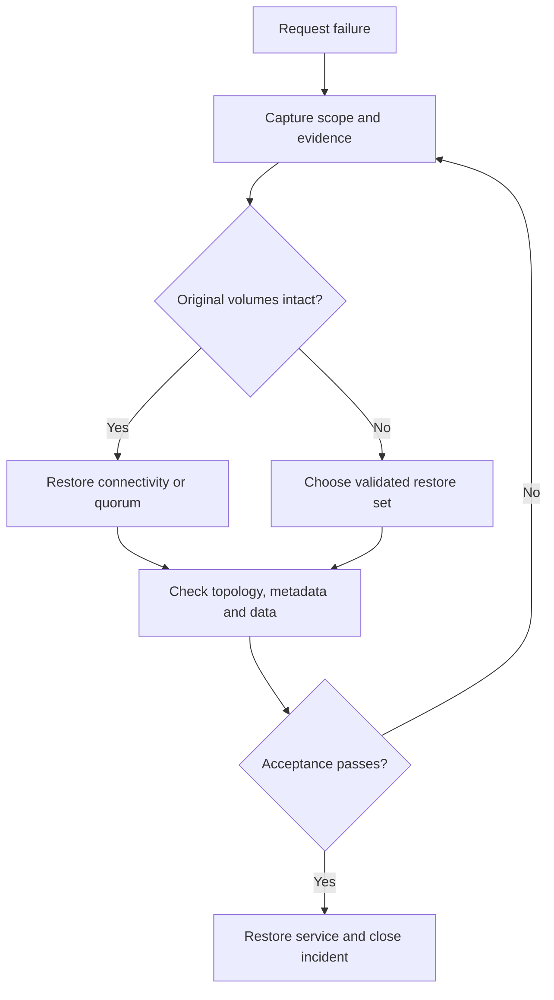

# 39 — Sharded Cluster Administration and Recovery

**Status:** Written; static review complete; runtime lab validation pending  
**Part:** 5 — Sharding and Scale  
**Goal:** Inventory the control and data planes, perform bounded failure drills, distinguish partial availability from complete results, and reconcile data and metadata after recovery.  
**Audience:** Developers, Data Engineers, DBREs, SREs and Platform Engineers  
**Time:** 120–150 minutes, including observation and recovery.  
**Baseline:** MongoDB 8.0 and mongosh; retain Chapter 35's pinned image digest and record exact binary/shell versions and FCV.  
**Deployment:** Isolated `mongodb-ch35` cluster, dedicated `cfg35`, shards `shard35a`/`shard35b`, routers `r1`/`r2`. Community-compatible.  
**Prerequisites:** Chapters 33–38; Chapter 38 cleanup complete; healthy original three-member replica sets and 1001-document Chapter 35 fixture; exclusive ownership of this disposable training deployment; capacity to restart members and preserve their volumes. Authentication requires scoped monitoring, replica administration, sharding administration and chapter CRUD privileges.

## 1. Administration starts with an availability contract

**Use case:** An event service reports failures during maintenance. A router is reachable, but that does not establish that every required shard or the metadata service is healthy. The operator must identify the unavailable component, measure the affected requests and restore the original topology before closing the incident.

This chapter creates a separate 400-document ranged collection. It deliberately places tenants 0–4 on shard A and tenants 5–9 on shard B. Three drills then test a config secondary restart, a shard-primary stop and a complete shard-A outage. Each drill ends with recovery before the next begins.

| Acceptance level | Evidence |
|---|---|
| Process | Expected containers running; no OOM/restart loop |
| Replica set | Correct identity/configuration; one primary and two healthy secondaries |
| Routing | Both routers; exact shard registration; intended query targets |
| Metadata | Expected UUID, key and range ownership; consistency cursor fully consumed |
| Application | Exact IDs/fields/counts; acknowledged writes reconciled; complete query results |

The drills preserve all original volumes. They do not restore a backup, prove application-driver automatic failover or simulate loss of the Docker host.

## 2. Failure domains and operator decisions

| Failure | Likely impact | First recovery direction |
|---|---|---|
| One router | Clients using that endpoint fail or reconnect | Restore endpoint; verify another router and real client behavior |
| One shard primary | Election and transient write interruption | Restore quorum and observe new primary; reconcile ambiguous writes |
| Entire shard | Its ranges unavailable; queries needing it fail unless explicitly accepting partial results | Restore that shard and verify every affected range |
| One config member | Reduced redundancy; primary loss may require election | Restore member and verify the CSRS |
| CSRS cannot elect a primary | Metadata changes cannot proceed; cached data routes may still work | Restore original voting majority; inspect metadata availability |
| All config members inaccessible | Metadata refresh/startup can fail; availability can deteriorate | Recover CSRS and cluster metadata before claiming recovery |

Config-quorum loss does not mean every cached application request immediately fails, and a successful cached request does not mean DDL is safe. This chapter keeps a CSRS majority available throughout its executable drills. Treat config-quorum loss as the separate recovery decision exercise in Section 13.

Never repair metadata by hand-editing `config.collections`, `config.chunks`, placement history or shard registrations. Direct member connections below perform replica administration only; application CRUD always uses `mongos`.

## 3. Recovery decision flow



Record the symptom time, detection time, first successful complete application request and final acceptance time. The first primary election and the final recovery of redundancy are different milestones. A successful `ping` is neither milestone for application correctness.

## 4. Verify and inventory the retained environment

Use **Bash** in Chapter 35's original directory containing `compose.yaml`, `.env` and `scripts/lib35.js`. The functions below are reused in later Bash blocks in this chapter.

```bash
dc() { docker compose -p mongodb-ch35 -f compose.yaml "$@"; }
set -a
source .env
set +a
mkdir -p scripts evidence-ch39
client39() {
  docker run --rm --network mongodb-ch35_cluster -v "$PWD/scripts:/scripts:ro" "$MONGO_IMAGE" mongosh 'mongodb://r1:27017/?serverSelectionTimeoutMS=5000&connectTimeoutMS=3000&socketTimeoutMS=30000' --quiet --file "/scripts/$1"
}
dc ps -a
dc stats --no-stream
docker run --rm --network mongodb-ch35_cluster -e EXPECTED_COUNT=1001 -v "$PWD/scripts:/scripts:ro" "$MONGO_IMAGE" mongosh 'mongodb://r1:27017/?serverSelectionTimeoutMS=5000' --quiet --file /scripts/verify35.js
docker run --rm --network mongodb-ch35_cluster -e EXPECTED_COUNT=1001 -v "$PWD/scripts:/scripts:ro" "$MONGO_IMAGE" mongosh 'mongodb://r2:27017/?serverSelectionTimeoutMS=5000' --quiet --file /scripts/verify35.js
```

Record the image digest, host/volume free space and container OOM state. Retain the rendered Compose configuration privately if it contains credentials. Confirm Chapters 36–38 left no active migration/resharding operation or chapter namespace. No other exercise may run during these faults. In production, establish a usable backup and maintenance/recovery plan before config-server maintenance; this reconstructible lab is not a substitute for that backup.

Save **`scripts/inventory39.js`**:

```javascript
load("/scripts/lib35.js");
router35();
printjson({ at: new Date(), routerVersion: db.version(), shellVersion: version(),
  hello: db.adminCommand({ hello: 1 }), shards: db.adminCommand({ listShards: 1 }),
  balancer: db.adminCommand({ balancerStatus: 1 }),
  balancerEnabled: sh.getBalancerState(), autoMergerEnabled: sh.isAutoMergerEnabled() });
for (const spec of sets35) {
  check35(ready35(spec), "Unhealthy original set: " + spec.name);
  const admin = seeded35(spec).getDB("admin");
  const fcv = admin.runCommand({ getParameter: 1, featureCompatibilityVersion: 1 });
  check35(fcv.ok === 1 && fcv.featureCompatibilityVersion.version === "8.0" &&
    !fcv.featureCompatibilityVersion.targetVersion, "FCV not stable at 8.0");
  printjson({ set: spec.name, build: admin.runCommand({ buildInfo: 1 }).version,
    fcv, configuration: admin.runCommand({ replSetGetConfig: 1 }),
    status: admin.runCommand({ replSetGetStatus: 1 }) });
}
const active = db.getSiblingDB("admin").aggregate([
  { $currentOp: { allUsers: true, localOps: false } },
  { $match: { $or: [ { "command.reshardCollection": { $exists: true } },
    { "originatingCommand.reshardCollection": { $exists: true } },
    { desc: /Resharding.*Service/ } ] } }
]).toArray();
printjson({ visibleReshardingOperations: active });
check35(active.length === 0, "Visible resharding operation; finish earlier recovery first");
```

```bash
client39 inventory39.js > evidence-ch39/before-inventory.json
```

An empty `$currentOp` result is an observation, not a complete migration-idleness proof. Inspect prior chapter terminal outcomes, collection metadata and balancer status as well. Do not proceed with unresolved maintenance.

## 5. Shared fixture and verification helpers

Save **`scripts/lib39.js`**:

```javascript
load("/scripts/lib35.js");
const name39 = "mongodb_enterprise_tutorial_ch39";
const ns39 = name39 + ".events";
const lab39 = db.getSiblingDB(name39);
const catalog39 = db.getSiblingDB("config");
const wc39 = { w: "majority", j: true, wtimeout: 10000 };
function equal39(a, b) { return EJSON.stringify(a) === EJSON.stringify(b); }
function fixture39() {
  return Array.from({ length: 400 }, (_, i) => ({
    _id: "ch39-" + String(i).padStart(4, "0"), tenantId: Math.floor(i / 40),
    seq: i, revision: 1, payload: "training-event-" + i
  }));
}
function meta39() {
  const m = catalog39.collections.findOne({ _id: ns39 });
  check35(m && m.uuid && m.unsplittable !== true && equal39(m.key, { tenantId: 1 }),
    "Missing or changed owned sharded metadata");
  check35(!m.reshardingFields, "Unresolved key change");
  return m;
}
function placement39() {
  const m = meta39();
  const ranges = catalog39.chunks.find({ uuid: m.uuid }).sort({ "min.tenantId": 1 }).toArray();
  check35(ranges.length === 2, "Unexpected number of ranges");
  check35(equal39(ranges[0].min, { tenantId: MinKey() }) &&
    equal39(ranges[0].max, { tenantId: 5 }) && ranges[0].shard === "shard35a" &&
    equal39(ranges[1].min, { tenantId: 5 }) &&
    equal39(ranges[1].max, { tenantId: MaxKey() }) && ranges[1].shard === "shard35b",
    "Placement differs from the failure contract");
  return ranges;
}
function verify39() {
  const docs = lab39.events.find({}).sort({ seq: 1 }).readConcern("majority")
    .maxTimeMS(10000).toArray();
  const expected = fixture39();
  check35(docs.length === 400, "Incomplete fixture");
  for (let i = 0; i < 400; i++) {
    for (const field of ["_id", "tenantId", "seq", "revision", "payload"]) {
      check35(docs[i][field] === expected[i][field], "Wrong data at " + i + "/" + field);
    }
  }
  check35(new Set(docs.map(d => d._id)).size === 400, "Duplicate IDs");
  const sum = docs.reduce((n, d) => n + d.seq, 0);
  check35(sum === 79800, "Wrong sequence total");
  const tenants = Array.from({ length: 10 }, (_, t) => docs.filter(d => d.tenantId === t).length);
  check35(tenants.every(n => n === 40), "Wrong tenant counts");
  return { count: docs.length, sum, tenants };
}
function names39(node, out = new Set()) {
  if (!node || typeof node !== "object") return out;
  if (typeof node.shardName === "string") out.add(node.shardName);
  for (const [k, v] of Object.entries(node)) {
    if (!["rejectedPlans", "allPlansExecution"].includes(k)) names39(v, out);
  }
  return out;
}
function explain39(query, targets, count) {
  const e = lab39.events.find(query).maxTimeMS(10000).explain("executionStats");
  printjson(e);
  const planned = [...names39(e.queryPlanner.winningPlan)].sort();
  const executed = [...names39(e.executionStats.executionStages)].sort();
  check35(equal39(planned, [...targets].sort()) && equal39(executed, [...targets].sort()),
    "Unexpected planned/executed shard targets");
  check35(e.executionStats.nReturned === count, "Wrong explain result count");
}
function policy39() {
  check35(typeof sh.isAutoMergerEnabled === "function", "Required shell helper unavailable");
  return { balancer: sh.getBalancerState(), autoMerger: sh.isAutoMergerEnabled() };
}
function ownership39() {
  const saved = lab39.control.findOne({ _id: "ownership" });
  check35(saved && saved.owner === "chapter39" && saved.ns === ns39,
    "Ownership checkpoint missing");
  check35(equal39(meta39().uuid, saved.uuid), "Collection replaced; do not drop it");
  check35(equal39(policy39(), saved.policy), "Global maintenance policy changed");
  const original = catalog39.collections.findOne({ _id: "mongodb_enterprise_tutorial_ch35.events" });
  check35(original && equal39(original.uuid, saved.originalUUID), "Original fixture replaced");
  return saved;
}
```

The collection has 10 tenants × 40 events, 400 unique IDs and sequence sum 79,800. Verifying these through a router catches missing/duplicate or altered records that a process-health check cannot detect. This deterministic reconciliation is not a general checksum strategy for mutable production data.

## 6. Create an owned fixture with deterministic placement

Save **`scripts/setup39.js`**. This is a fresh setup, not a script to rerun after an uncertain insert or partial setup.

```javascript
load("/scripts/lib39.js");
router35();
for (const spec of sets35) check35(ready35(spec), "Unhealthy set");
check35(lab39.getCollectionNames().length === 0 &&
  !catalog39.collections.findOne({ _id: ns39 }), "Namespace already exists; reconcile first");
for (const n of [36, 37, 38]) {
  check35(db.getSiblingDB("mongodb_enterprise_tutorial_ch" + n).getCollectionNames().length === 0,
    "Prior chapter cleanup incomplete");
}
const original = catalog39.collections.findOne({ _id: "mongodb_enterprise_tutorial_ch35.events" });
check35(original && original.uuid, "Original fixture metadata missing");
const policy = policy39();
check35(lab39.createCollection("events").ok === 1, "Cannot create collection");
lab39.events.createIndex({ tenantId: 1 });
check35(db.adminCommand({ shardCollection: ns39, key: { tenantId: 1 } }).ok === 1,
  "Cannot shard fixture");
check35(sh.disableBalancing(ns39).ok === 1, "Cannot disable collection balancing");
check35(db.adminCommand({ configureCollectionBalancing: ns39, enableAutoMerger: false }).ok === 1,
  "Cannot disable collection AutoMerger");
check35(sh.splitAt(ns39, { tenantId: 5 }).ok === 1, "Cannot split fixture");
for (const [bounds, to] of [
  [[{ tenantId: MinKey() }, { tenantId: 5 }], "shard35a"],
  [[{ tenantId: 5 }, { tenantId: MaxKey() }], "shard35b"]
]) {
  const range = catalog39.chunks.findOne({ uuid: meta39().uuid, min: bounds[0] });
  check35(range && equal39(range.max, bounds[1]), "Wrong range before move");
  if (range.shard !== to) check35(db.adminCommand({ moveChunk: ns39, bounds, to }).ok === 1,
    "Cannot place range");
}
const inserted = lab39.events.insertMany(fixture39(), { writeConcern: wc39 });
check35(inserted.acknowledged && Object.keys(inserted.insertedIds).length === 400,
  "Incomplete insert; reconcile before retry");
check35(lab39.control.insertOne({ _id: "ownership", owner: "chapter39", ns: ns39,
  uuid: meta39().uuid, originalUUID: original.uuid, policy, at: new Date() },
  { writeConcern: wc39 }).acknowledged, "Ownership checkpoint failed");
placement39();
printjson(verify39());
explain39({ tenantId: 2 }, ["shard35a"], 40);
explain39({ tenantId: 8 }, ["shard35b"], 40);
explain39({}, ["shard35a", "shard35b"], 400);
printjson({ fixtureReady: true, uuid: meta39().uuid, policy });
```

```bash
client39 setup39.js > evidence-ch39/setup.json
```

Collection balancing and AutoMerger are disabled only for the new fixture so its two-range contract stays fixed. Global policy is recorded and never deliberately changed. The small ranges are a routing fixture, not recommended production range sizes.

If setup fails, preserve its output. Inspect namespace, indexes, UUID, ranges and documents before deciding whether a scoped rebuild is appropriate. Never blindly repeat `insertMany` or drop an unrecognized UUID.

## 7. Establish a repeatable healthy acceptance check

Save **`scripts/verify39.js`**:

```javascript
load("/scripts/lib39.js");
wait35("router and registration", () => { router35(); return true; });
for (const spec of sets35) wait35("healthy " + spec.name, () => ready35(spec));
ownership39();
printjson({ placement: placement39(), data: verify39() });
const inconsistencies = lab39.checkMetadataConsistency({ checkIndexes: true }).toArray();
printjson({ inconsistencies });
check35(inconsistencies.length === 0, "Metadata/index inconsistency; preserve evidence");
explain39({ tenantId: 2 }, ["shard35a"], 40);
explain39({ tenantId: 8 }, ["shard35b"], 40);
explain39({}, ["shard35a", "shard35b"], 400);
printjson({ verified: true, at: new Date(), router: db.getMongo().toString() });
```

```bash
client39 verify39.js > evidence-ch39/baseline.json
```

The consistency helper returns a cursor: `.toArray()` consumes all result batches. Do not treat an empty first batch with a live cursor as a complete clean report. This check is scoped to the chapter database, not a declaration that every database is consistent. Index checks run only while index DDL is absent. Any returned inconsistency is evidence to investigate, not permission to edit catalog records.

## 8. Select the actual member before stopping it

Primaries can change between runs. Never assume `a1` or `cfg1` has a particular role. Save **`scripts/select-member39.js`**:

```javascript
load("/scripts/lib35.js");
const role = process.env.ROLE39;
check35(["cfg-secondary", "a-primary"].includes(role), "Unexpected selection role");
const spec = role === "cfg-secondary" ? sets35[0] : sets35[1];
check35(ready35(spec), "Set not fully healthy before member selection");
const status = seeded35(spec).getDB("admin").runCommand({ replSetGetStatus: 1 });
const wanted = role === "cfg-secondary" ? "SECONDARY" : "PRIMARY";
const member = status.members.find(m => m.health === 1 && m.stateStr === wanted);
check35(member && spec.hosts.includes(member.name), "No valid member selected");
const service = member.name.split(":")[0];
check35((role === "cfg-secondary" ? ["cfg1", "cfg2", "cfg3"] : ["a1", "a2", "a3"])
  .includes(service), "Invalid Compose service");
print(service);
```

Use the resulting names only after Bash validates them. A role selection is a point-in-time observation; capture status/logs if an election races the stop. This procedure stops a selected container; it does not promise that it was still primary at the instant of shutdown.

## 9. Drill A: restart one config-server secondary

**Trigger:** Stop one observed CSRS secondary while the other two members remain healthy. **Expected:** Reduced redundancy, with fixture reads still available. **Repair:** Start the same member using its existing volume, wait for complete readiness and verify routed data.

```bash
CFG39=$(docker run --rm --network mongodb-ch35_cluster -e ROLE39=cfg-secondary -v "$PWD/scripts:/scripts:ro" "$MONGO_IMAGE" mongosh 'mongodb://r1:27017/' --quiet --file /scripts/select-member39.js) || exit 1
case "$CFG39" in cfg1|cfg2|cfg3) ;; *) exit 1 ;; esac
printf '%s\n' "$CFG39" > evidence-ch39/config-member.txt
date -u +%FT%TZ > evidence-ch39/config-stop-time.txt
dc stop -t 30 "$CFG39"
docker run --rm --network mongodb-ch35_cluster -v "$PWD/scripts:/scripts:ro" "$MONGO_IMAGE" mongosh 'mongodb://r2:27017/?serverSelectionTimeoutMS=5000&socketTimeoutMS=30000' --quiet --eval 'load("/scripts/lib39.js"); router35(); printjson(verify39()); printjson(seeded35(sets35[0]).getDB("admin").runCommand({replSetGetStatus:1}));' > evidence-ch39/config-degraded.json
dc start "$CFG39"
client39 verify39.js > evidence-ch39/config-recovered.json
dc logs --since 10m --tail 200 cfg1 cfg2 cfg3 > evidence-ch39/config-logs.txt
```

Do not run the full healthy-set verifier while this member is intentionally stopped: it requires all three members. If the degraded read fails, start the member immediately, preserve the error and investigate before moving on. This exercise proves a one-member restart in this topology, not independence across failure zones.

## 10. Drill B: stop the observed shard-A primary

Save **`scripts/write-after-election39.js`**:

```javascript
load("/scripts/lib39.js");
router35();
const admin = seeded35(sets35[1]).getDB("admin");
wait35("shard A writable primary", () => {
  const h = admin.runCommand({ hello: 1 });
  return h.ok === 1 && h.setName === "rs35a" && h.isWritablePrimary === true;
});
wait35("two surviving shard-A members", () => {
  const s = admin.runCommand({ replSetGetStatus: 1 });
  return s.ok === 1 && s.members.filter(m => m.health === 1).length === 2 &&
    s.members.filter(m => m.health === 1 && m.stateStr === "PRIMARY").length === 1 &&
    s.members.filter(m => m.health === 1 && m.stateStr === "SECONDARY").length === 1;
});
const status = admin.runCommand({ replSetGetStatus: 1 });
printjson(status);
const query = { tenantId: 2, _id: "ch39-0080" };
const changed = lab39.events.updateOne(query, { $set: { revision: 2 } }, { writeConcern: wc39 });
check35(changed.acknowledged && changed.matchedCount === 1, "Write uncertain or unmatched");
const read = lab39.events.find(query).readConcern("majority").maxTimeMS(10000).toArray();
check35(read.length === 1 && read[0].revision === 2, "Acknowledged write not reconciled");
const reset = lab39.events.updateOne(query, { $set: { revision: 1 } }, { writeConcern: wc39 });
check35(reset.acknowledged && reset.matchedCount === 1, "Reset uncertain");
printjson({ at: new Date(), writeVerified: true, data: verify39() });
```

```bash
APRIMARY39=$(docker run --rm --network mongodb-ch35_cluster -e ROLE39=a-primary -v "$PWD/scripts:/scripts:ro" "$MONGO_IMAGE" mongosh 'mongodb://r1:27017/' --quiet --file /scripts/select-member39.js) || exit 1
case "$APRIMARY39" in a1|a2|a3) ;; *) exit 1 ;; esac
printf '%s\n' "$APRIMARY39" > evidence-ch39/shard-primary.txt
date -u +%FT%TZ > evidence-ch39/shard-primary-stop-time.txt
dc stop -t 30 "$APRIMARY39"
client39 write-after-election39.js > evidence-ch39/shard-election-write.json
dc start "$APRIMARY39"
client39 verify39.js > evidence-ch39/shard-election-recovered.json
dc logs --since 10m --tail 200 a1 a2 a3 r1 r2 > evidence-ch39/shard-election-logs.txt
```

The two surviving voters can elect a primary. `dc stop` is a graceful process stop and can permit orderly handoff; this is not a crash, partition or disk-loss test. Record the actual new primary and timings without claiming a fixed election duration. The fresh shell shows server recovery, not transparent reconnection by the application driver.

If either update reports a timeout/disconnect, the write outcome may be unknown. Start the stopped member first; read `_id:ch39-0080` through a router with majority read concern. Reconcile the actual revision before resetting it to 1 with the same full shard-key predicate. Do not repeat a non-idempotent business write to “see if it works.” Preserve both failure and reconciliation evidence.

## 11. Drill C: complete shard-A outage and targeted survival

Save **`scripts/shard-outage39.js`**. It does not read the unsharded ownership checkpoint, which may be hosted on the unavailable shard.

```javascript
load("/scripts/lib39.js");
router35();
check35(ready35(sets35[0]) && ready35(sets35[2]), "Config set or surviving shard unhealthy");
function read39(filter) {
  return lab39.runCommand({ find: "events", filter, sort: { seq: 1 },
    batchSize: 1000, singleBatch: true, maxTimeMS: 5000,
    allowPartialResults: false, readConcern: { level: "majority" } });
}
const surviving = read39({ tenantId: 8 });
printjson({ label: "targeted-survivor", response: surviving });
check35(surviving.ok === 1 && surviving.cursor.firstBatch.length === 40,
  "Surviving tenant query failed or incomplete");
const expected = fixture39().filter(d => d.tenantId === 8);
for (let i = 0; i < 40; i++) {
  for (const field of ["_id", "tenantId", "seq", "revision", "payload"]) {
    check35(surviving.cursor.firstBatch[i][field] === expected[i][field], "Survivor data mismatch");
  }
}
for (const [label, filter] of [["unavailable-tenant", { tenantId: 2 }], ["all-tenants", {}]]) {
  let failed = false;
  try {
    const result = read39(filter);
    printjson({ label, response: result });
    if (result.ok !== 1) {
      check35([50, 133].includes(result.code) ||
        /Timeout|HostUnreachable|HostNotFound|FailedToSatisfyReadPreference|Network/.test(result.codeName || ""),
        "Unexpected failure category; investigate instead of accepting outage result");
      failed = true;
    }
  } catch (e) {
    printjson({ label, error: String(e), code: e.code, codeName: e.codeName });
    check35([50, 133].includes(e.code) ||
      /Timeout|HostUnreachable|HostNotFound|FailedToSatisfyReadPreference|Network/.test(e.codeName || e.name || ""),
      "Unexpected client error; outage not established");
    failed = true;
  }
  check35(failed, "Unexpected successful response while required shard is stopped");
}
const query = { tenantId: 8, _id: "ch39-0320" };
const changed = lab39.events.updateOne(query, { $set: { revision: 2 } }, { writeConcern: wc39 });
check35(changed.acknowledged && changed.matchedCount === 1, "Survivor write uncertain");
const after = read39(query);
check35(after.ok === 1 && after.cursor.firstBatch.length === 1 &&
  after.cursor.firstBatch[0].revision === 2, "Survivor write not reconciled");
const reset = lab39.events.updateOne(query, { $set: { revision: 1 } }, { writeConcern: wc39 });
check35(reset.acknowledged && reset.matchedCount === 1, "Survivor reset uncertain");
printjson({ at: new Date(), survivingShardWriteVerified: true });
```

```bash
client39 verify39.js > evidence-ch39/before-full-shard-stop.json
date -u +%FT%TZ > evidence-ch39/full-shard-stop-time.txt
dc stop -t 30 a1 a2 a3
client39 shard-outage39.js > evidence-ch39/full-shard-outage.json
dc start a1 a2 a3
client39 verify39.js > evidence-ch39/full-shard-recovered.json
dc logs --since 10m --tail 200 a1 a2 a3 r1 r2 > evidence-ch39/full-shard-logs.txt
```

Capture stderr as well if the client exits unsuccessfully. Restore A immediately even when an assertion fails; do not proceed to another fault. The 5-second server budget and 30-second socket budget bound probes, but elapsed wall time can include selection/retry/network overhead. An unexpected timeout on the survivor is a failed drill requiring investigation, not evidence of successful partial availability.

`allowPartialResults:false` is explicit. The all-tenant request must not be presented as complete when A is unavailable. Enabling partial results changes the application contract and cannot be used to satisfy this acceptance check. Counts and reports across tenants must fail visibly or carry a reviewed incompleteness contract.

An interrupted B write/reset may leave revision 2 on `_id:ch39-0320`. After restoring A, inspect and reconcile that one document as in Section 10 before running the full verifier. All other expected fields and documents must remain unchanged.

## 12. Post-recovery verification and router restart

After all shard members are restored, restart only one router and run fresh clients through both endpoints. This checks recovery without relying solely on the router connection used during the drills.

```bash
dc restart r1
client39 verify39.js > evidence-ch39/final-r1.json
docker run --rm --network mongodb-ch35_cluster -v "$PWD/scripts:/scripts:ro" "$MONGO_IMAGE" mongosh 'mongodb://r2:27017/?serverSelectionTimeoutMS=5000&socketTimeoutMS=30000' --quiet --file /scripts/verify39.js > evidence-ch39/final-r2.json
docker run --rm --network mongodb-ch35_cluster -e EXPECTED_COUNT=1001 -v "$PWD/scripts:/scripts:ro" "$MONGO_IMAGE" mongosh 'mongodb://r1:27017/' --quiet --file /scripts/verify35.js
docker run --rm --network mongodb-ch35_cluster -e EXPECTED_COUNT=1001 -v "$PWD/scripts:/scripts:ro" "$MONGO_IMAGE" mongosh 'mongodb://r2:27017/' --quiet --file /scripts/verify35.js
client39 inventory39.js > evidence-ch39/after-inventory.json
dc ps -a
dc stats --no-stream
```

Compare before/after set identities, replica configurations, shard registration, UUIDs, range owners and global maintenance flags. Primaries and election terms may differ; original set names, member identities and collection UUIDs must not. Replica health alone does not prove an exact production recovery point; this fixture also reconciles every application record.

Persistent `StaleConfig` or routing errors require checking actual catalog availability, lag, migrations and logs. Routine cache flushing or router restarts are not repairs for lost metadata or an unreachable shard. Use `flushRouterConfig` only when diagnosis supports refreshing that router's cache and verify afterward.

## 13. Config quorum and backup recovery decision exercise

**Tabletop only:** Suppose two CSRS members are unavailable. Do not stop them in this chapter. Write the decision and required evidence for each case:

| Observed condition | Decision | Required evidence |
|---|---|---|
| Original volumes intact; network/process fault | Restore connectivity and original majority | Set identity, voter reachability, storage health, primary election |
| A member lost but a valid majority survives | Replace/resync that member using the supported CSRS procedure | Healthy authoritative majority, config/member inventory, current backup |
| No authoritative CSRS copy can be recovered | Choose a validated cluster restore plan | Compatible config-and-shard recovery points, keys, topology, restore rehearsal |
| Shard data exists but catalog was lost | Preserve data and escalate recovery planning | UUID/range history and validated metadata backup; never guess ownership |

Do not use forced reconfiguration as the default response to an outage. Returning original voters is the lab's recovery path. An unsupported “new empty config set + register existing shards” procedure does not reconstruct the cluster's routing history.

For a backup-based disaster recovery plan, document these gates:

1. Identify the backup mechanism and its supported sharded-cluster consistency procedure. A config-only copy cannot restore application data; independent shard snapshots cannot be assumed to share a recovery point.
2. Preserve every required CSRS and shard backup, replica configurations, image versions/FCV, keyfiles/certificates and encryption key access. Record recovery point and expected data loss explicitly.
3. Restore into an isolated target following the exact provider/tool/version procedure. Prevent application writers from reaching that target while recovery is incomplete.
4. Restore the metadata and data components as a compatible set. Follow the documented ordering and connection-string/identity requirements; do not improvise file-copy or replica-reset commands.
5. Verify topology, metadata/index consistency and business reconciliation through routers. Record actual RPO/RTO and resource requirements before approving application cutover.
6. Keep the previous deployment and recovery evidence according to the rollback/retention plan. Validate a fresh backup of the recovered deployment.

This is a decision checklist, not an executed restore lab. For Enterprise deployments, use the supported Ops Manager backup/restore workflow appropriate to the installed release. An ordinary live `mongodump` through a router should not be assumed to capture a consistent cluster while transactions, writes or balancing continue. Filesystem and dump approaches have distinct prerequisites; follow their complete procedures rather than combining fragments.

## 14. Incident troubleshooting and escalation

| Symptom | Collect first | Interpretation/action |
|---|---|---|
| Router connects; request times out | Predicate, expected targets, router/shard logs, member status | Availability depends on required shards, not router ping |
| New primary exists; majority write times out | Actual write response, matching document, reachable voters/lag | Outcome may be unknown; reconcile before replay |
| Member restarts in recovery loop | Exit/OOM state, disk permissions/space, mongod log, version/digest | Repair underlying cause; preserve volume |
| CSRS primary unavailable | Original voter connectivity, set status, config string, storage | Restore majority before metadata operations |
| Metadata check reports inconsistencies | Complete cursor output, UUIDs, logs, versions, recent changes | Pause conflicting changes and escalate; no manual catalog edit |
| Tenant B fails while only A is stopped | Actual explain/placement, CSRS/B health, connection budgets | Intended targeting or baseline assumptions were wrong |
| Global balancer/AutoMerger state differs | Ownership checkpoint, settings, concurrent admin activity | Identify external change; do not blindly overwrite policy |
| Full verifier has one revision 2 | Probe acknowledgement/errors and exact owned document | Reconcile the probe/reset; investigate any other mismatch |
| Removed member needs initial sync | Oplog window, last applied point, authoritative healthy peers | Use supported resync/replacement workflow; preserve forensic evidence |

Separate an unavailable member from an unavailable range, an incomplete report and actual data loss. The response and recovery plan should name which one is established. Preserve the first useful errors and timestamps instead of discarding them after a retry succeeds.

Production monitoring should include per-set primary/quorum, lag and oplog retention; per-shard disk/free space and I/O; WiredTiger pressure; router selection/connection errors; migration/resharding state; and application latency/error rates by request class. Define alerts that distinguish reduced redundancy from lost service and assign an owner for restoring redundancy.

## 15. Cleanup and interrupted-run recovery

Restore all intentionally stopped services before cleanup. These commands reuse original volumes and configuration:

```bash
dc start cfg1 cfg2 cfg3 a1 a2 a3 b1 b2 b3 r1 r2
client39 verify39.js
```

If the verifier fails because one probe revision remained at 2, first inspect the two exact documents through a router. Save the observations, determine which write/reset was interrupted, and reset only a confirmed owned probe with its full key. A discrepancy anywhere else is not cleanup work; investigate it.

Example reconciliation in an interactive **mongosh connected to r1**, after restoring all members:

```javascript
load("/scripts/lib39.js");
router35();
ownership39();
for (const [tenantId, id] of [[2, "ch39-0080"], [8, "ch39-0320"]]) {
  const docs = lab39.events.find({ tenantId, _id: id }).readConcern("majority")
    .maxTimeMS(10000).toArray();
  printjson({ probe: id, documents: docs });
  check35(docs.length === 1 && [1, 2].includes(docs[0].revision), "Unexpected probe state");
}
```

Only after inspecting those results and establishing the interrupted probe, run the matching reset, for example:

```javascript
const reset39 = lab39.events.updateOne({ tenantId: 8, _id: "ch39-0320" },
  { $set: { revision: 1 } }, { writeConcern: wc39 });
check35(reset39.acknowledged && reset39.matchedCount === 1, "Reset not confirmed");
printjson(verify39());
```

Save **`scripts/cleanup39.js`**:

```javascript
load("/scripts/lib39.js");
router35();
for (const spec of sets35) check35(ready35(spec), "Restore original members first");
const saved = ownership39();
placement39();
verify39();
const collections = lab39.getCollectionNames();
check35(collections.length === 2 && collections.every(n => ["events", "control"].includes(n)),
  "Unexpected collection; stop cleanup");
check35(catalog39.tags.countDocuments({ ns: ns39 }) === 0, "Unexpected fixture zone");
check35(sh.enableBalancing(ns39).ok === 1, "Cannot restore collection default");
check35(db.adminCommand({ configureCollectionBalancing: ns39, enableAutoMerger: true }).ok === 1,
  "Cannot restore collection AutoMerger default");
check35(lab39.dropDatabase().ok === 1, "Scoped drop failed");
check35(!catalog39.collections.findOne({ _id: ns39 }) &&
  catalog39.tags.countDocuments({ ns: ns39 }) === 0, "Catalog cleanup incomplete");
check35(equal39(policy39(), saved.policy), "Global policy changed during cleanup");
printjson({ cleanupComplete: true, retainedOriginalFixture: true, policy: policy39() });
```

```bash
client39 cleanup39.js > evidence-ch39/cleanup.json
docker run --rm --network mongodb-ch35_cluster -e EXPECTED_COUNT=1001 -v "$PWD/scripts:/scripts:ro" "$MONGO_IMAGE" mongosh 'mongodb://r1:27017/' --quiet --file /scripts/verify35.js
docker run --rm --network mongodb-ch35_cluster -e EXPECTED_COUNT=1001 -v "$PWD/scripts:/scripts:ro" "$MONGO_IMAGE" mongosh 'mongodb://r2:27017/' --quiet --file /scripts/verify35.js
docker run --rm --network mongodb-ch35_cluster "$MONGO_IMAGE" mongosh 'mongodb://r2:27017/' --quiet --eval 'const n="mongodb_enterprise_tutorial_ch39"; if(db.getSiblingDB(n).getCollectionNames().length || db.getSiblingDB("config").collections.findOne({_id:n+".events"})) throw new Error("Chapter cleanup incomplete"); print("Chapter 39 namespace absent");'
```

Keep the cluster, Chapter 35 fixture and evidence for Chapter 40. Do not run `down -v`, delete volumes, recreate replica sets or remove shard registrations as rollback. Before setup creates its ownership checkpoint, failures require manual inspection of the exact chapter namespace; the guarded cleanup deliberately refuses to guess ownership.

## 16. Acceptance checklist, evidence and review questions

- [ ] Exact image, versions/FCV, topology and baseline verified.
- [ ] Owned fixture has 400 unique records, 40 per tenant and sum 79,800.
- [ ] UUID/key and two-range ownership established; actual explain targets verified.
- [ ] Selected config secondary stopped, routed reads verified, same member restored.
- [ ] Observed shard primary stopped; surviving voters served reconciled majority write.
- [ ] Whole shard A stopped; tenant B returned its exact 40 records and accepted a reconciled write.
- [ ] Tenant A and complete all-tenant queries failed visibly without partial-results opt-in.
- [ ] All stopped members restored; fresh clients through both routers passed full acceptance.
- [ ] Complete chapter metadata/index consistency cursor had no findings.
- [ ] Global maintenance flags and original Chapter 35 UUID/data preserved.
- [ ] Backup-recovery decisions written; actual restore remains separately untested.
- [ ] Chapter namespace removed; original 1001-document fixture verified through both routers.

**Evidence:** Before/after inventory, role-selection names, UTC timestamps, stop/start outputs, server and client errors, degraded-set status, actual elected primary, write acknowledgement and read-back, targeted versus complete-query outcomes, both final verifiers, full consistency results and cleanup. Record measured recovery times and failed assertions. Static parsing does not satisfy runtime acceptance.

**Review questions:**

1. Why is a successful router ping insufficient for an all-tenant report?
2. Which request class survives a complete shard-A outage in this fixture, and why?
3. Why does a reachable new primary not guarantee that a majority write succeeds immediately?
4. How do you reconcile a write that timed out after reaching the server?
5. Why select the actual member instead of assuming `a1` is primary?
6. How does config-quorum loss differ from a shard's quorum loss?
7. Why consume the entire metadata-consistency cursor?
8. What does this graceful stop test leave unproven about crash/partition behavior?
9. Why can't independent config and shard backups be assumed to form a consistent restore set?
10. What prevents cleanup from deleting a replaced or unrelated collection?

## 17. References and next chapter

- [MongoDB 8.0: troubleshoot sharded clusters](https://www.mongodb.com/docs/v8.0/tutorial/troubleshoot-sharded-clusters/)
- [MongoDB 8.0: config servers and availability](https://www.mongodb.com/docs/v8.0/core/sharded-cluster-config-servers/)
- [MongoDB 8.0: metadata consistency helper](https://www.mongodb.com/docs/v8.0/reference/method/db.checkMetadataConsistency/)
- [MongoDB 8.0: find command and partial results](https://www.mongodb.com/docs/v8.0/reference/command/find/)
- [MongoDB 8.0: sharded-cluster backup and restore](https://www.mongodb.com/docs/v8.0/administration/backup-sharded-clusters/)
- [MongoDB 8.0: restore from filesystem snapshots](https://www.mongodb.com/docs/v8.0/tutorial/restore-sharded-cluster/)
- [Chapter 35 — Build a Sharded Lab Cluster](35-build-a-sharded-lab-cluster.md)
- [Chapter 38 — Resharding and Shard Key Refinement](38-resharding-and-shard-key-refinement.md)

Next: **Chapter 40 — Scaling and Sharding Acceptance Lab** (planned).
